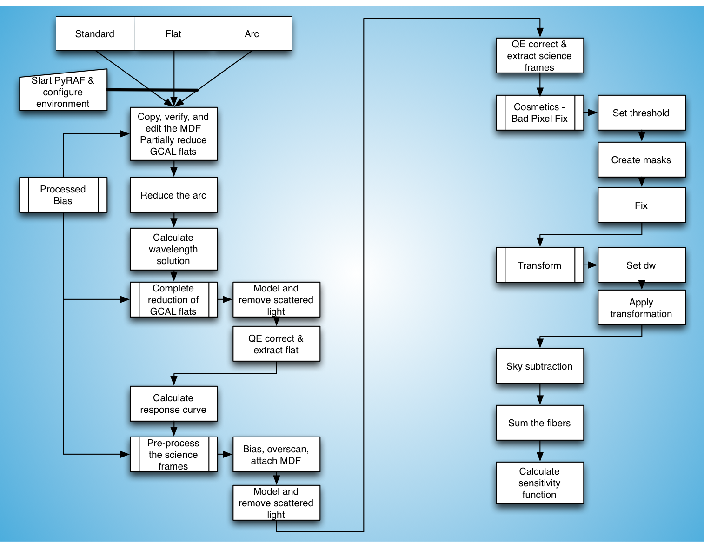

.. standardstar.rst

.. _standardstar:

*************
Standard star
*************
The reduction of the spectrophotometric standard is very similar to
the reduction of the science frames. The main differences start after
the sky subtraction.  For the standard star, we calculate the sensitivity
function, for the science we apply that sensitivity function and then
create cubes.

Note that there is no real reason to do the cosmic ray rejection for
the standard stars: the flux is strong enough that it does not make any
difference.  Adding to that that running L.A.Cosmic is very time consuming,
the justification gets even thinner.

In the tutorial, we do show how to calculate the sensitivity function.
We do not however show how to reduce the standard star; just apply the
same steps as for the science frames, up to and including the sky
subtraction.

Here is a flow chart that can be followed.

