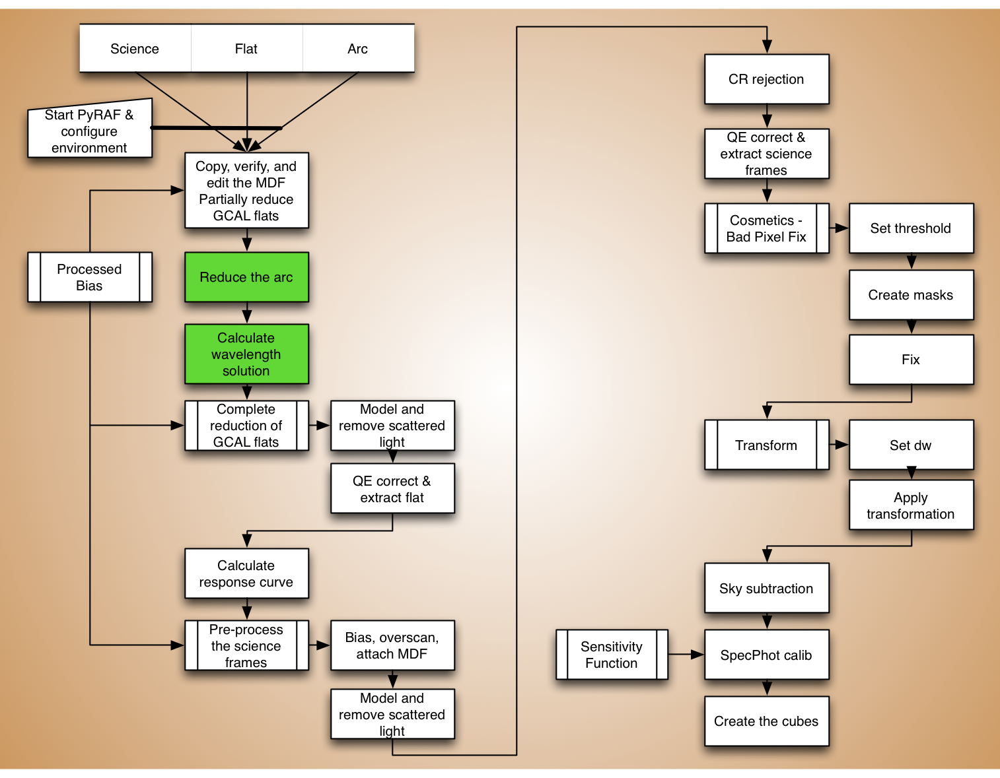

.. arc.rst

.. _arc:

*******************
Wavelength Solution
*******************

.. image:: _graphics/GMOSIFU-ProcessChart_Science.png
   :scale: 20%
   :align: right

Extract the arc
===============

The first step in calculating the wavelength solution is to reduce and
extract the arc lamp exposure.  Note that no biases are ever taken for
the arcs.  We will therefore turn off the bias subtraction but we will
keep the overscan correction on in our call to ``gfreduce``.  We use
our modified MDF and we will use the *trace reference* we produced from
the flat in the previous step.

As before, we first set some key variables, then we call ``gfreduce``. This
step takes a couple minutes to run.

.. 2 minutes.

|
|
|
|
|
|

::

    rawdir = '../tutorial_data/'

    mdf = 'gmos$data/gsifu_slitr_mdf.fits'
    bias = '../calibrations/S20060314S0091_bias.fits'
    flatref = iraf.head('flat.lis', nlines=1, Stdout=1)[0].strip()

::

    imdelete('g@arc.lis')
    imdelete('rg@arc.lis')
    imdelete('erg@arc.lis')

    for arc in iraf.type('arc.lis', Stdout=1):
        iraf.gfreduce(arc, rawpath=rawdir, fl_extract='yes', recenter='no', \
             trace='no', reference='erg'+flatref, fl_bias='no', \
             fl_over='yes', slits='red', mdffile=mdf, mdfdir='./', \
             fl_fluxcal='no', fl_gscrrej='no', fl_wavtran='no', \
             fl_skysub='no', fl_inter='no')

Measure the wavelength solution
===============================
The author of this tutorial strongly recommend to run the ``gswavelength``
task in interactive mode, always.  The automatic line identification fails
too often.

In this section, we will show what to do when it works, and what to do when
it does not.

Automatic line identification
-----------------------------
For our tutorial dataset, the automatic line identification does **not** work.
We will have to it manually.  Before we embark on that task, let's have a
look at what "works well" means and how to confirm it, for those lucky cases.
Then we will show how to get out of the interactive mode and have the
solution written to disk.

The call to ``gswavelength`` is going to be the same as with the manual
mode.  We will cover that later.  Here we will just show screenshots.

The first plot is the spectrum with the emission lines identified.  It looks
like the identification was successful.

But **always** check the fit.  That is done by type "``f``" in the
spectrum window.  We will practice that function later.

This is the plot of the fit.  A good fit for GMOS always looks like a
parabola, like in this plot.  Also note that the fit is tight and clearly
goes through the points.

This fit is fine, we then would leave the interactive mode as follow

::

    - Type "q" to quit the "fit window".
    - Type "q" again to quit the "spectrum window".
    - Answer "NO" (uppercase) to "Fit dispersion function interactively".

|

**Note**

There are cases where it *looks* like the line identification worked in the first
plot, but the second plot will show either an odd fit, or a large spread in the
points on the left half (blue) of the plot.  When that happens, the lines
on the right half a normally well identified but those on the left half are
completely wrong.  The solution in such case is to delete ("``d``") all the
bad ones, redo the fit ("``f``"), type ("``l``") to see if some new identifications
will be triggered, and finally manually fill in that section of the spectrum.
In the
next section, we will go through all this in the most extreme case, yet quite common, where
no identification is done at all and it must all be done manually.

Manual line identification
--------------------------
We are not lucky enough to have the automatic identification work for our
dataset.  It will need to be done manually.
::

    for arc in iraf.type('arc.lis', Stdout=1):
        iraf.gswavelength('erg'+arc, fl_inter='yes', \
                     nlost=10, ntarget=15, threshold=25, \
                     coordlis='gmos$data/GCALcuar.dat')

No line at all get identified.  The lines will need to be manually marked...
But do not despair.  A fair initial fit can be obtained with only four lines
manually identified.  Then some are identified automatically.  And we
complete with a semi-manual identification.  Tedious, but not too hard.

The four line we have to identify are in those yellow boxes, 2 lines each.
To do the line mapping, there is a chart on the Gemini website:

    `<https://www.gemini.edu/sciops/instruments/gmos/calibration/example-cal-data/cuar-spectra>`_

The first plot from that page is the one we need.  Those plots are bit hard
to read.  The lines we will have no mark are shown in red.

Let us zoom onto those two boxes and mark the lines::

    - To zoom in, "w", "e"-"e" to define the box.
    - To mark a line, "m" with the cursor on the line.
    - Enter the wavelength in the text box and press "Return".
    - To zoom out, "w", "a".

Repeat for the second box.

This is what the spectrum should look like:

Now we fit.  Look for the parabola.

::

    - Type "f".

The fit is good, the lines were identified correctly, now let's identify
more.

::

    - Quit the "fit window" with "q".  (Just once!)
    - Type "l" to automatically fit the lines the tool can fit now.
      It is a small number put it helps.
    - Type "f" to get a fit with the extended list of lines.
    - Type "q" to return to the "spectrum window".

Now we will semi-manually identify the other lines.  Not all of them just
enough to have a better coverage.

::

    - With the cursor on a line, type "m".
    - Next to the text box, there will be a proposed wavelength with
      the line name between the parenthesis. This means that there
      is a match with the line list.  (Red oval below.)
    - Press "Return".  No need to type the wavelength, the software
      already has that info from the line list.

If a line mark returns "INDEF", it is because the software cannot associate
it with one on the line list.  Just press "``Return``" then bring the cursor
back on it and delete it with "``d``".

Keep at it, when you are done with a zoomed in section, zoom out and
zoom in on the next section.  Repeat until the whole spectrum as marked
lines.

Then fit the solution again::

    - Type "f" to for the final fit.
    - If you are happy with it, "q" to quit the "fit window".
    - "q" to quit the "spectrum window"
    - Answer "NO" (uppercase) to "Fit dispersion function interactively".

