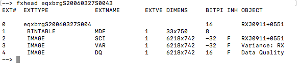

.. badcolumn.rst

.. _badcolumn:

*******************
Fixing a bad column
*******************

.. image:: _graphics/GMOSIFU-ProcessChart_Science.png
   :scale: 20%
   :align: right

Bad columns do happen.  The GMOS-S EEV CCDs indeed had one bad column section.
Fixing it is purely cosmetic in most cases.  At the very least however, the
affected pixels should be marked as "bad" in the data quality plane.

Here we will interpolate the bad pixels from the bad columns to "fix" them.
The interpolation must be done along the horizontal axis since each line is
a spectrum.  We will also mark those pixels in the data quality, DQ, plane.

The first step is to identify the affect pixels and create a mask for them.

|
|
|
|
|
|

::

    display eqxbrgS20060327S0043.fits[sci,1] 1

By hovering the cursor over the image, we find that columns 3994 to 3996
are bad in their entirety and that for rows 18 to 134, it is columns 3994
to 4002 that are affected.

The format for the text version is "x1 x2 y1 y2".  We add those boxes to
a text file, then we use ``text2mask`` to convert that into an IRAF ``pl``
file which is required later on.  ``text2mask`` need to know the size of
the output which must match the image we want to correct.  In our case,
that is 6218 by 742.  You can get that information with ``fxhead``.

::

    fxhead eqxbrgS20060327S0043

::

    !echo '3994 3996 1 17' > maskbadcol.txt
    !echo '3994 4002 18 134' >> maskbadcol.txt
    !echo '3994 3996 135 742' >> maskbadcol.txt
    iraf.text2mask('maskbadcol.txt', 'maskbadcol.pl', 6218, 742)

The next series of commands simply use ``fixpix`` to interpolate the
bad columns, then add the bad pixel mask to the DQ plane.   The ``copy``'s
and ``imcopy``'s are to ensure that the work is done temporary
copies instead of the input file, just in case something goes wrong and
we want to do it again.

::

    for sci in iraf.type('sci.lis', Stdout=1):
        sci = sci.strip()
        iraf.copy('eqxbrg'+sci+'.fits', 'tmp'+sci+'.fits')
        iraf.proto.fixpix('tmp'+sci+'.fits[sci,1]', 'maskbadcol.pl', \
                          linterp='1,2,3,4')
        iraf.copy('tmp'+sci+'.fits', 'xeqxbrg'+sci+'.fits')
        iraf.imarith('maskbadcol.pl', '+', 'xeqxbrg'+sci+'.fits[dq,1]', \
                     'tmpdq'+sci)
        iraf.imcopy('tmpdq'+sci+'[*,*]', 'xeqxbrg'+sci+'.fits[dq,1][*,*]')

    imdelete('tmp*.fits')
    delete('mask*.pl')

::

    display xeqxbrgS20060327S0043.fits[sci,1] 1

