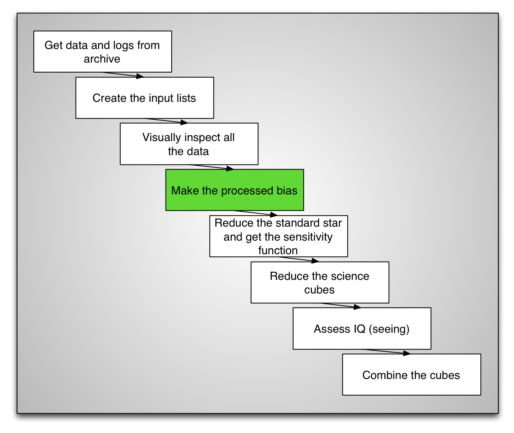
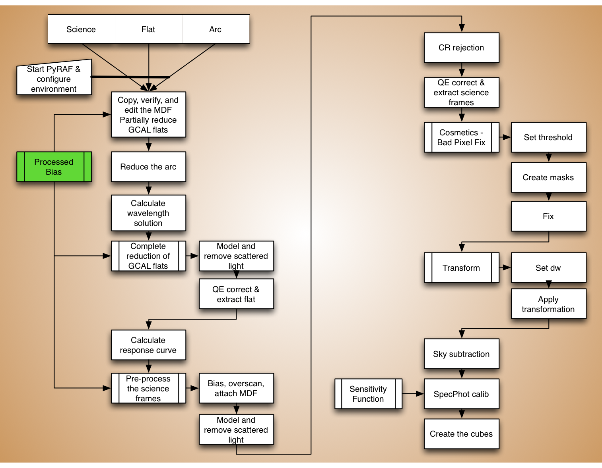
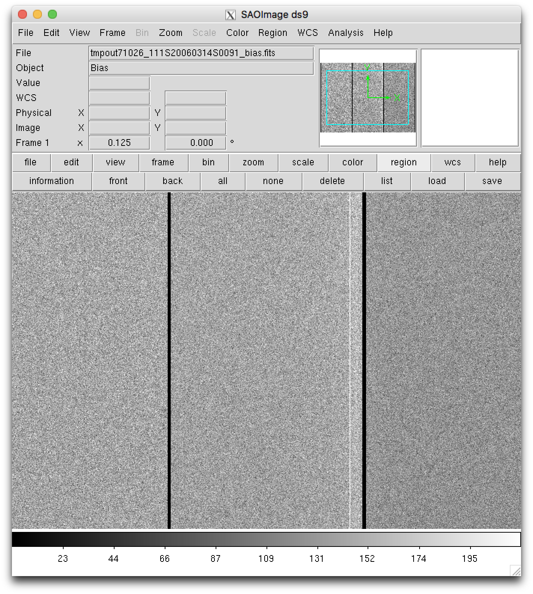

.. bias.rst

.. _bias:

*********************
Make a processed bias
*********************

Remember to work from the ``redux`` directory.

Let's define a few variables::

    procbias = 'S20060314S0091_bias.fits'
    rawdir = '../tutorial_data/'
    caldir = '../calibrations/'

The settings above and the content of the bias list are the only things that
need to be modified if you were to run the commands below on a different
set of biases.

To create the processed bias, we use the ``gbias`` task in the ``gmos``
package.  In the snippet below, we delete any outputs from a previous
run, create the bias, then copy the processed bias to the directory where
we will store the processed calibrations.

In this tutorial, the processed bias will be stored in a different directoy,
same for the sensitivity function.  The motivation
for storing the processed calibration safely out of ``redux`` is that later
on, if we decide to restart the science reduction from scratch, we can just
delete everything in ``redux`` knowing that the master bias and the sensitivity
function are safe and won't have to be created again.  This is preference,
not a requirement.

::

    imdelete(procbias)
    imdelete('g@bias.lis')

    gbias('@bias.lis', procbias, rawpath=rawdir, fl_vardq='yes')
    copy(procbias, caldir)

Finally, it is recommended to inspect the result.  After all, that master
bias will affect every other frames we will reduce, might as well make sure
it looks okay.

::

    gdisplay(procbias, 1, fl_paste='no')

