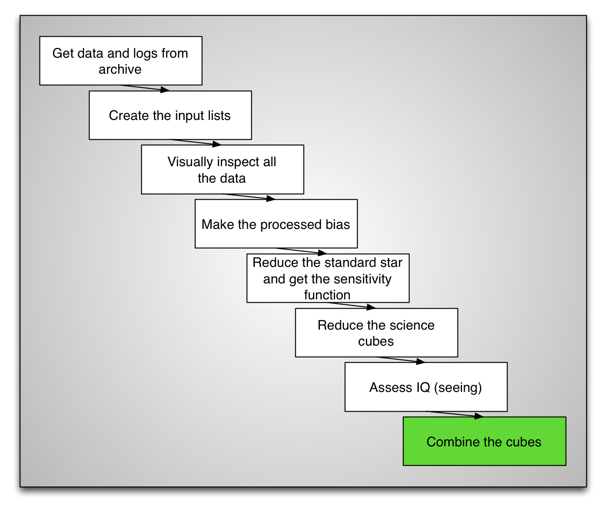
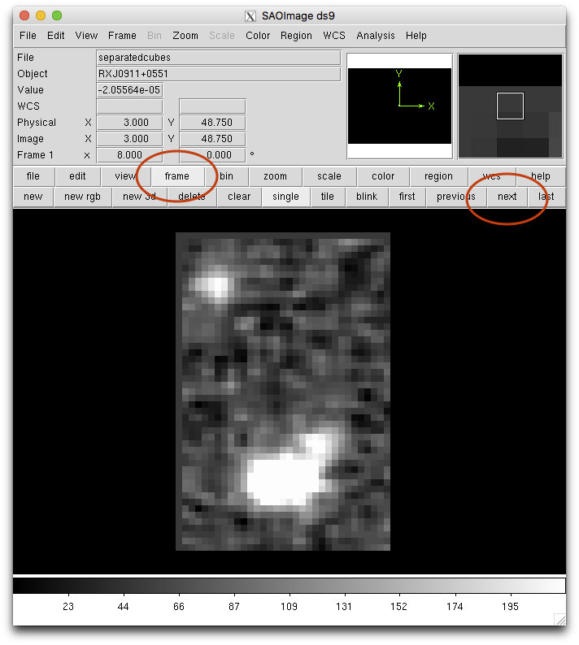

.. combinecube.rst

.. _combinecube:

*************
Combine cubes
*************

The Gemini IRAF package does NOT have a routine to stack / combine the cubes.
One of the Gemini data reduction staff member, James Turner, has written such
a routine for his own research and has shared it on the Gemini Data Reduction
Forum (http://drforum.gemini.edu).  See the installation chapter for details
on download and installation instructions for the "``pyfu``" package.

In this tutorial we have reduced only one cube because of time constraints.
We need another one if we are to combine cubes.  Let's copy another cube
over::

    iraf.copy('../tutorial_data/cstxeqxbrgS20060327S0042_3D.fits', '.')

The task ``pyfalign`` will modify the World Coordinate System (WCS) in the
header of the input files.  To avoid touching the original, it is
preferable to copy them over to another directory to do the work.  We can
simply create a new directory in ``redux`` named ``combine`` and copy the
cubes there.

::

    !mkdir combine
    copy ('*3D.fits', 'combine/')
    cd combine

Then we can load the ``pyfu`` package.

::

    pyfu

The task ``pyfalign`` will find the highest peak in each image and assume
that that is the center of the brightest source, then use that position to
align the cubes relative to the first cube in the list.

Because in our cubes, the blue end is very noisy, we want to avoid that noise
being recognized as the "highest peak".  The simplest way to do that is
to tell ``pyfalign`` to ignore the blue end, and use only the pixels from
a wavelength pixel of about 500 and on.  This will truncate the cube along the
wavelength axis.

::

    pyfalign ('*_3D*', llimit=500)

After the ``pyfalign`` step, it is good practice to verify the alignment.
We can call ``pyfmosaic``, the stacking routine, in a "non-stacking" mode.
It will resample and align the cubes, but will not stack them.  Instead
it will put each aligned cubes in separate extensions.  We can then
visually inspect the alignment.

::

    pyfmosaic ('*_3D*', 'separatedcubes', separate=yes)

::

   display separatedcubes[sci,1][*,*,3000] 1
   display separatedcubes[sci,2][*,*,3000] 2

The display commands above put a slice of both cubes in different image
buffers.  Then we can "blink" the two in ``ds9``.  Click on "frame", then
you can keep clicking on "next" and the two buffers will alternate.

If the images look align, ``pyfalign`` was successful and we can stack
the cubes.  We also propagate the variance to the final cube.

::

    pyfmosaic ('*_3D*', 'FinalCube.fits', var='yes')

We can run the wavelength movie again on the stacked cube.

::

    import astropy.io.fits as fits
    import numpy as np
    import imexam
    import time

    display = imexam.connect(list(imexam.list_active_ds9())[0])

    cube = fits.open('FinalCube.fits')
    im = np.add.reduce(cube[1].data[500:,:,:])
    display.view(im)
    display.scale('zscale')
    time.sleep(10)
    for position in range(0, cube[1].data.shape[0], 10):
        slice = np.add.reduce(cube[1].data[position:position+10,:,:])
        display.view(slice)

