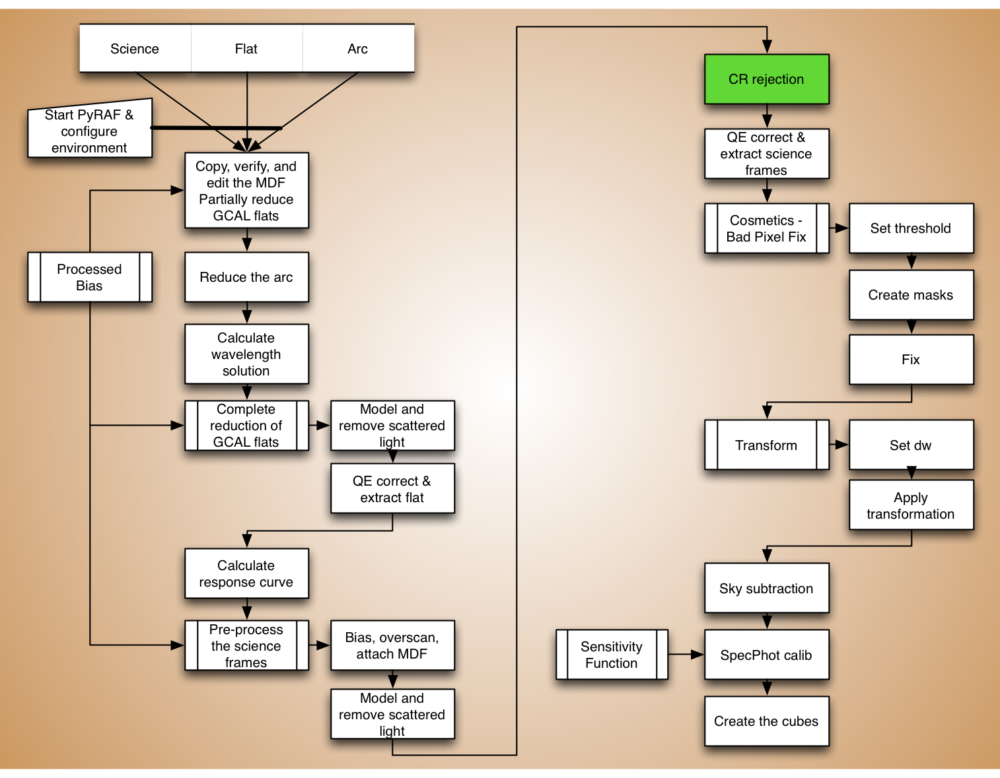

.. crrejection.rst

.. _crrejection:

********************
Cosmic Ray Rejection
********************
.. image:: _graphics/GMOSIFU-ProcessChart_Science.png
   :scale: 20%
   :align: right

.. warning::  LIVE TUTORIAL. We will **not** run this step.  Too slow.

The Gemini IRAF task ``gemcrspec`` uses the L.A.Cosmic algorithm written
by P.G. van Dokkum to remove cosmic rays.  Specifically, it makes use of the
``lacos_spec.cl`` implementation of the algorithm.  If you followed the
instructions in the chapter on installation, you should be ready to go.

.. warning::  LIVE TUTORIAL.  The output of this step is available in
   the ``tutorial_data`` directory.  For the live tutorial, we copy that
   version over to our work directory and move on to the next step.

::

    iraf.copy('../tutorial_data/xbrgS20060327S0043.fits', './')

|
|

----

If you are not attending a live tutorial and are willing to wait, you can
run the commands below.  Obviously, if you are using this tutorial to reduce
your own data, you do need to run the commands below.

Let us make sure it is installed correctly by doing a little smoke test.

::

    lpar lacos_spec

If that worked and you saw the list of input parameters, you can proceed.
If not, you need to go back to the chapter on software installation and
follow the L.A.Cosmic instructions at the end of that chapter.

::

    imdelete('xbrg@sci.lis')

    for sci in iraf.type('sci.lis', Stdout=1):
        sci = sci.strip()
        iraf.gemcrspec('brg'+sci, 'xbrg'+sci, logfile='crrej.log', \
                  key_gain='GAIN', key_ron='RDNOISE', xorder=9, \
                  yorder=-1, sigclip=4.5, sigfrac=0.5, objlim=1., \
                  niter=4, verbose='yes', fl_vardq='yes')

