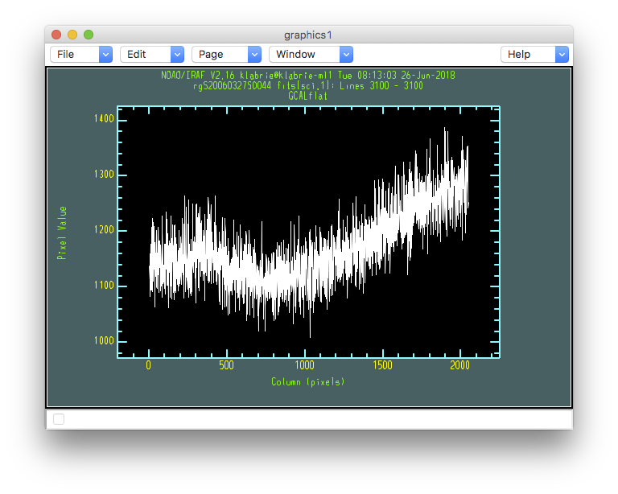

.. flat.rst

.. _flat:

********************
Reduce the lamp flat
********************
.. image:: _graphics/GMOSIFU-ProcessChart_Science.png
   :scale: 20%
   :align: right

The flat we extracted earlier was not corrected for quantum efficiency
variation between the chips and was not either corrected for scattered
light.  That extracted flat was used solely as a trace reference.

Here we complete the proper reduction of the flat field.  We already have
an intermediate flat that has been bias and overscan corrected and with
an MDF attached.  We can start from that file.  The file prefix we are
looking for is "rg".

We start with the modeling and removal of the scattered light.  Then
we follow with the QE correction and the extraction.

Short note on GMOS CCDs
=======================
Over the life of both GMOSes, various CCDs have lived in the instruments.
For GMOS-North, there were the EEV, the e2V, and now the Hamamatsu CCDs.
For GMOS-South, it has been the EEV and now the Hamamatsu CCDs.
This matters on many levels.

For QE, the GMOS-N e2V were deemed sufficiently identical that no QE correction
was required.  If you try to QE correct those CCDs, it will fail as no
solution were ever calculated.  Simply skip that step if you have GMOS-N e2V
data.  (To recognize those, note that the raw e2V data has 6 extensions.)

For the scattered light, it is the number of amps, and therefore the effective
size of the image each one produces that matters.  As we will see below the
scattered light is modeled spatially on each amp separately.  When the detector
functions in 1-amp per CCD mode, like for the old EEV, we have a wider
surface to fit than when the detector operates in a 4-amp per CCD mode
(Hamamatsu).  In
the later, each image extension is a thin sliver of the CCD.  This can affect
the fit order, especially along the X-axis.  A smaller order will be
sufficient for the 4-amp per CCD mode.

The image on the left is one amp from an EEV CCD.  One amp covers all the
CCD.  On the right is one amp from a Hamamatsu CCD.  One amp covers a
fourth of the CCD.

Remove scattered light
======================

In the areas between bundles, some of them marked with yellow arrows below,
there is scattered light.  The brighter the source, the brighter the stray
light.  That light should not be there.  It is detected between the
bundles but it is really everywhere.  Those inter-bundle area are essential to the
modeling of the scrattered light and therefore its removal: it should be
zero flux in the those area, any light there is "bad" light.

|
|
|
|
|
|
|
|

We can visually inspect the effect of the scattered light with column and
line plots.

::

    imexamine rgS20060327S0044.fits[sci,1] 1

.. code-block:: text

    - Type "c" for a column plot.
    - For a line plot, put the cursor in an inter-bundle area and
      type "l"

See how in the column plot (above) the flux between the bundles does not go
all the way to zero? That is because of the scattered light.

Below is a line plot of one of the inter-bundle area.  It definitely does
not go to zero and there is even pattern to it.

Find the gaps
-------------
The first step is to identify where the inter-bundle areas are located.
This is done with the ``gffindblocks``.  We use the same *trace reference*
we used to reduce the arc.  (Do not worry about the top part with ``sections``
and ``delete``. It is just an IRAF way to automated the clean up of files
before running ``gffindblocks``.)

::

    sections('blkmask_@flat.lis', Stdout='blkmask.lis')
    delete('@blkmask.lis', verify='no')
    delete('blkmask.lis', verify='no')

    for flat in iraf.type('flat.lis', Stdout=1):
        flat = flat.strip()
        iraf.gffindblocks('rg'+flat, 'erg'+flat, 'blkmask_'+flat)

Model and remove the light
--------------------------
Now we use the light in those gaps to create a 2-D surface model of the scattered
light present in the image.  The ``xorder`` and ``yorder`` parameters are the
values that might have to be changed.  The number of orders must
be either one (to be applied to all extensions) or match the number of
extensions (ie. the number of amps.)

Here we have three CCDs, with 1-amp per CCD, so 3 extensions.  For these EEV
CCDs, a good starting point is to use order 3 for all extensions and for both
``xorder`` and ``yorder``.

It is recommended to run ``gfscatsub`` in interactive mode, unless you are
using order 1 for everything.  The reason is that sometimes the fit "flares up".
We show an example below.  The solution when that happens is to reduce the
order of the fit for the extension affected.  From experience, normally it is
the ``xorder`` value that needs to be modified.

Let's try it and see what we get.  We want smooth fits, with no big wavy
flare ups.

::

    imdelete('brg@flat.lis')

    for flat in iraf.type('flat.lis', Stdout=1):
        flat = flat.strip()
        iraf.gfscatsub('rg'+flat, 'blkmask_'+flat, outimage='', \
                  prefix='b', xorder='3,3,3', yorder='3,3,3', \
                  cross='yes', fl_inter='yes')

The fits for extension 1 and 2 (above left and right) are smooth, no
extreme values.  The fit for extension 3 however (right) flares up and down at the
edges and corners.  If you hover the cursor on top of the flares you will see
values very different from the more smooth area.  Clearly the fit has gone
wrong.  The solution is normally to lower the ``xorder`` for that extension.

We started at 3, we could try 2, but in the interest of time, let's jump
straight to 1, as that is where we will end up anyway in this case.

|

::

    imdelete('brg@flat.lis')

    for flat in iraf.type('flat.lis', Stdout=1):
        flat = flat.strip()
        iraf.gfscatsub('rg'+flat, 'blkmask_'+flat, outimage='', \
                  prefix='b', xorder='3,3,1', yorder='3,3,3', \
                  cross='yes', fl_inter='yes')

We have loss the ability to fit the details of the scattered light pattern
but at least we have sensible values.  This is sufficient.  The variations
left are well within the uncertainties.

The fits look right, let us verify anyway that they are successful in removing
the scattered light.  To do that, we repeat the inspection we did at the
start of this chapter, we look at the inter-bundle gaps for scattered light.

|
|
|
|

::

    for flat in iraf.type('flat.lis', Stdout=1):
        flat = flat.strip()
        for i in range(3):
            iraf.imexamine('brg'+flat+'[sci,'+str(i+1)+']', 1)

.. code-block:: text

    - Type "c" for a column plot.
    - For a line plot, put the cursor in an inter-bundle area and
      type "l"

Now in the column plot (above) the flux between the bundles goes to zero.
And in the line plot (below), there is still minor structure but it is
small and more importantly, it fluctuates around zero instead of 1150.

QE correct and extract
======================
The next step is to apply the quantum efficiency correction and finally
extract the flat field.  No interactivity here, very straightforward.

We need the arc because the QE correction is wavelength dependent.  We do not
need to bias and overscan correct, that has already been done.

::

    mdf = 'gsifu_slitr_mdf.fits'

::

    imdelete('eqbrg@flat.lis')

    arc = iraf.head('arc.lis', nlines=1, Stdout=1)[0].strip()

    gfreduce('brg@flat.lis', fl_extract=yes, fl_qecorr='yes', \
             qe_refim='erg'+arc, fl_addmdf='no', fl_bias='no', \
             fl_over='no', fl_trim='no', mdffile=mdf, mdfdir='./', \
             slits='red', fl_fluxcal='no', fl_gscrrej='no', \
             fl_wavtran='no', fl_skysub='no', fl_inter='no', \
             fl_vardq='yes')

::

    for flat in iraf.type('flat.lis', Stdout=1):
        iraf.gfdisplay('eqbrg'+flat, 1, version=1)

.. code-block:: text

    - Press <spacebar> on a fiber to see the spectrum.
    - Type "q" to quit.

The plot below is for same flat fiber as before, several chapters ago.
The big jump in QE between the chips has been corrected.  In fact maybe
a bit over corrected, but there is not much we can do about that.  It is
still much better than it was.

