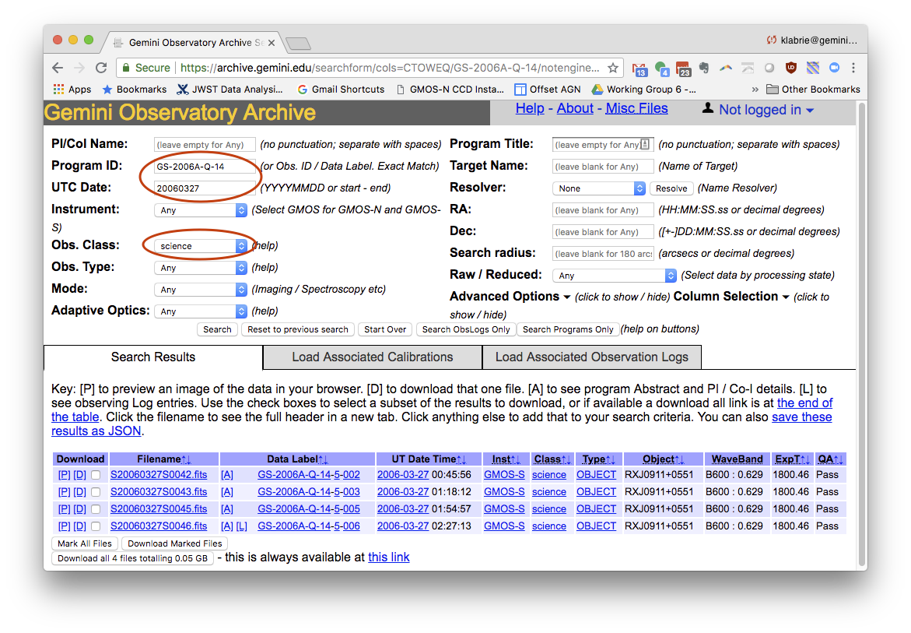

.. getdata.rst

.. _getdata:

************
Get the data
************

.. image:: _graphics/GMOSIFU-ProcessChart_Data.png
   :scale: 20%
   :align: right

We have already provided you with the data you will need
to complete this tutorial, even some necessary pre-reduced data.
(See the last section of installation chapter, :ref:`install-data-label`.)

For you own program, you will have to collect your data yourself,
so here is a little primer on how to do that.

Searching the archive
=====================
The primary search criterium is your program ID.  Just typing that in the
``Program ID`` box will return everything that was in your Phase 2 and that was
observed.

Then you can refine your search to focus on specific targets and observation
sequences.

Raw biases
----------

We start by refining the search with the date of the observation and the
``Obs. Class``, or "observation class".  Setting the ``Obs. Class`` to
``science`` returns the on-target observations only, none of the calibrations
that were part of the sequence.  We will get those later.  For now, we
want to find the raw biases associated with the science observations specifically.

Today we will use only one frame.  To focus on a single frame, use the full
data label for the observation in ``Program ID``.  To get the list of
compatible biases we switch to the ``Load Associated Calibrations`` tab.

We get a list of compatible calibrations, starting with the raw biases.
For some reason, some biases end up with a value for EXPTIME in their
headers that is not zero.  This is not understood.  Those biases in general
look fine.  Nevertheless, there are plenty more biases, pick the ones with
zero exposure time.

Arc
---
Staying on the same page, scroll down until you find the associated arc lamp
observation.

Flat
----
For GMOS IFU observation, the flat field is taken right before or after the
science observation.  It is part of the observation sequence.  To figure
out which flat goes with which science observation, we identify the
"observation ID" and input that in the ``Program ID`` search box.

From this sequence, it is clear that the first flat goes with the first
science frame, the flat in the middle goes with the second and third
science frame and the last flat with the last science frame.

In our case, our science-flat pair is #43 and #44.

Standard star
-------------
The spectrophotometric standard is defined in the program as a "partner
calibration."  This means that we can find all the standard star observations
of our program with the "program ID" and by setting ``Obs.Class`` to
"partnerCal".

Then we can scroll to find the standard star sequence that
matches our data.  Our science data uses the "B600 : 0.629" configuration
so that is the one we pick.

Since it is observed just 4 days after
the science, a search for raw biases will result in essentially the same
raw biases as for the science frame; here we will use the same master bias for
both science and standard.

Prepared tutorial data
======================
All the data needed for this tutorial is provided in the data package,
``data_pkg_GMOSIFU_Tutorial.tar.gz`` available for download at:

   `<http://www.gemini.edu/sciops/data/software/datapkgs/datapkg_GMOSIFU_Tutorial.tar.gz>`_

See the last section of the Installation chapter, :ref:`install-data-label`,
for details.
