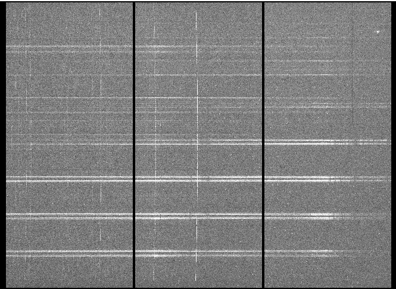
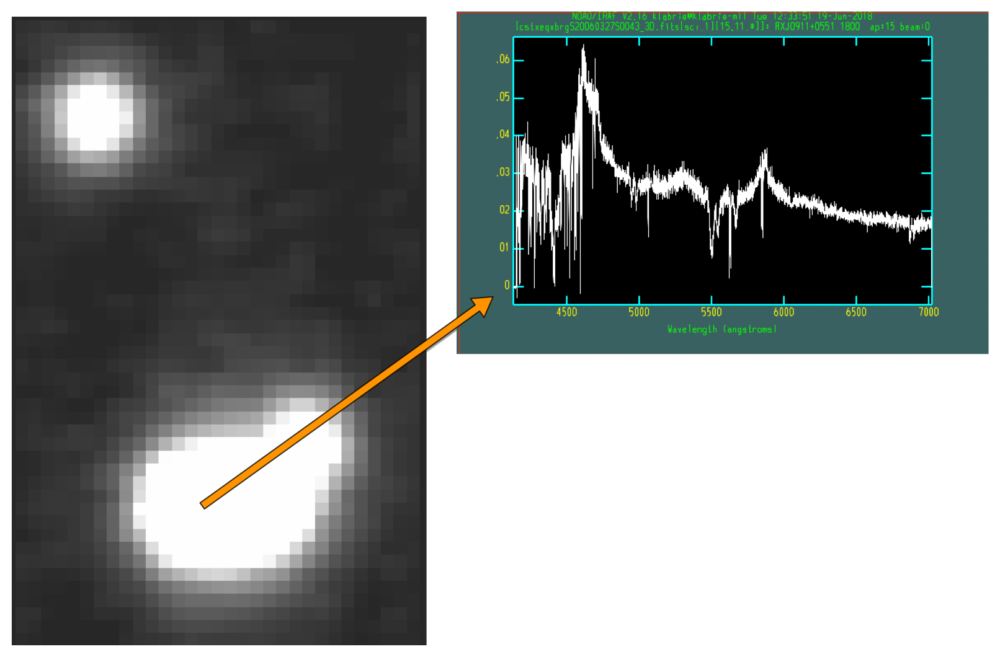
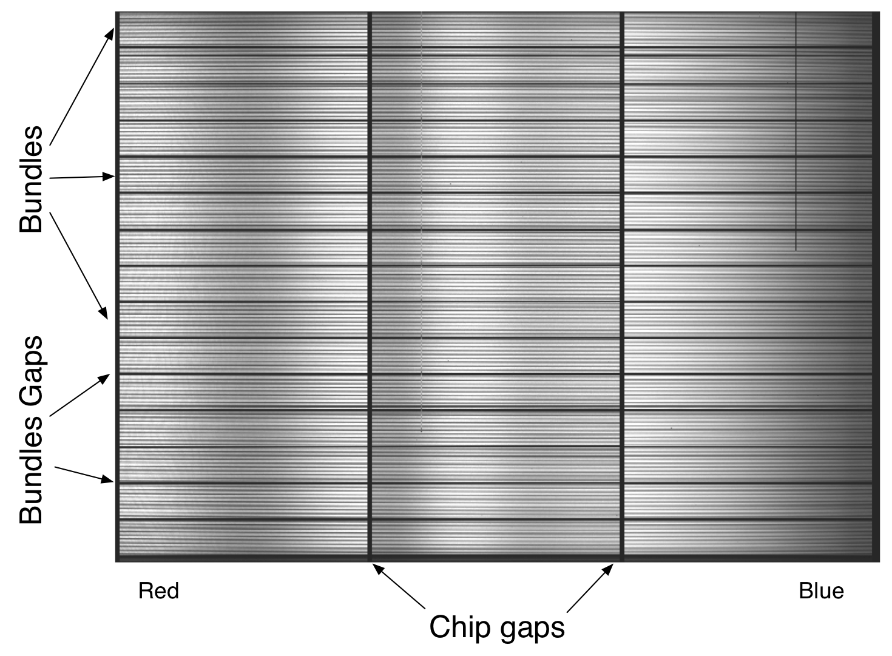
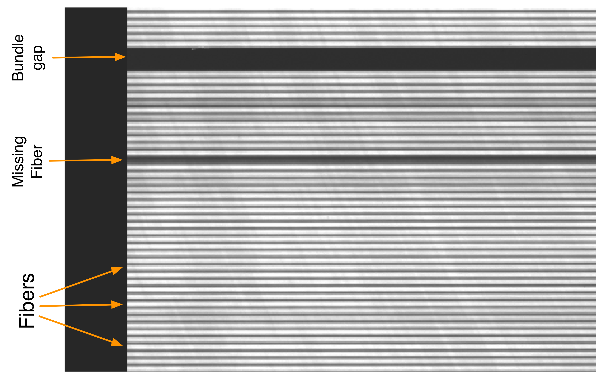
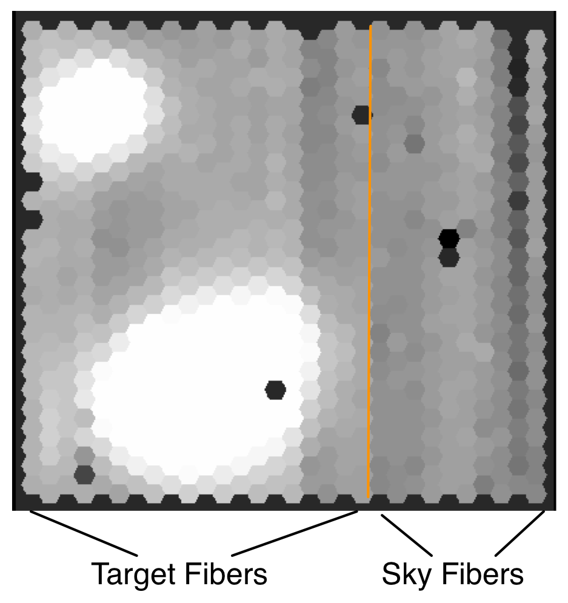

.. gmosifu.rst

.. _gmosifu:

***********************
Quick intro to GMOS IFU
***********************

Hardware
========
The GMOS Integral Field Unit (IFU) offers spatially resolved spectroscopy.
For each point in the field of view, a spectrum is obtained.  The GMOS IFU
is fiber fed.  It uses a lenslet array with each lenslet coupled to a fiber.
The other end of the fibers are then organized into a linear array at the
nominal location of the spectrograph's slit.  Some fibers are sampling an empty
area of the sky for sky subtraction.

The GMOS IFU offers a 2-slit mode and 1-slit mode.  The 1-slit mode offers a
smaller spatial field-of-view but a larger wavelength coverage compared to the
IFU-2 mode.  In this tutorial, we focus exclusively on the IFU-1 mode.

For more information about GMOS IFU, go to the Gemini website:

    `<https://www.gemini.edu/sciops/instruments/gmos/integral-field-spectroscopy>`_

Data
====
Since here we are talking about data reduction, let's first look at what the
data look like and what the hardware quickly described above produces.  This
will help us understand the data and what we are going to do to it.

Our objective
-------------
Our objective is to convert a raw frame like this:

into a cube of spatially positioned spectra that looks like this:

Fiber layout
------------
Let's look at a raw GCAL flat where all the fibers have been well illuminated.

The fibers are collected into bundles.  Each bundle has 50 fibers.  We can
see the bundles clearly separated on a raw flat.  Ten of those bundles
are for the target, five of them are for the sky.

The space between the bundle is actually very useful. We use it to model the
scattered light which we can then remove.

The vertical black bands are the chip gaps.  GMOS uses 3 CCDs separated from
each other by a small physical gap.

Also note that until the data has been ``transformed``, ie. until the
wavelength solution has been applied to a frame and it has been resampled,
red is left and blue is right.

If we zoom in, a lot, we start seeing the light from the individual fibers.
We can also spot "missing" fibers, e.g. fibers with very low throughput,
vignetted fibers, etc.

The sky bundles point to a nearby empty patch of the sky.  That patch of sky
is not directly adjacent to the target field like ``gfdisplay`` might suggest
in the image reconstruction below.  In ``gfdisplay``, each hexagon represents
one fiber.  The sky fibers are on the right side of the orange line.
They will be used for sky subtraction.

