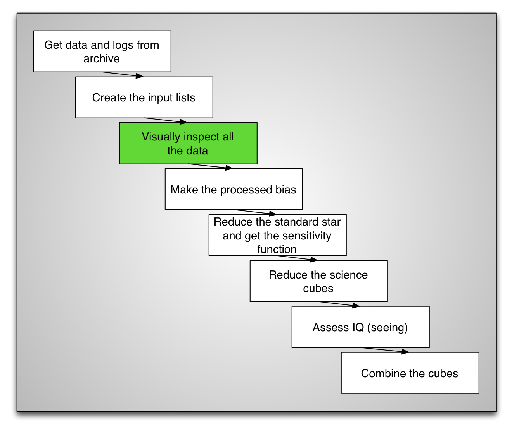
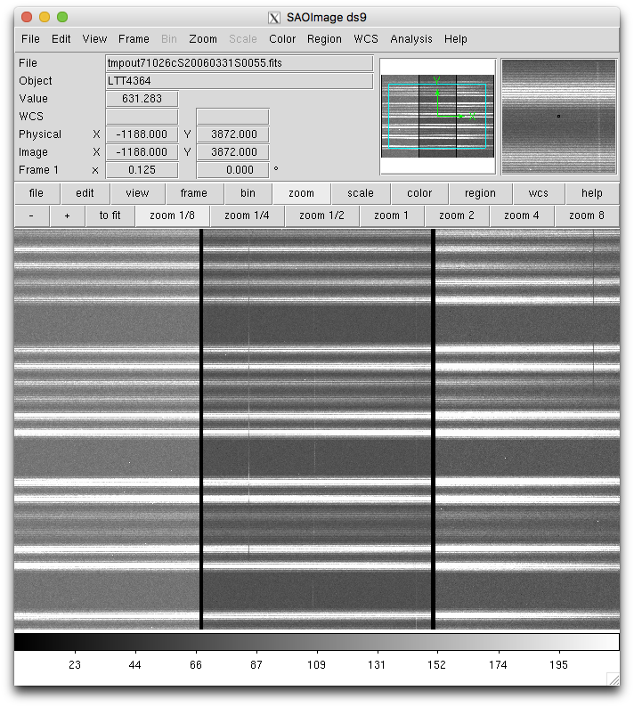

.. inspect.rst

.. _inspect:

****************
Inspect the data
****************

At night, the observer keeps an eye on the seeing, the cloud cover, and the
background.  This is done from the acquisition images.  The spectroscopic
data is checked for saturation and is visually inspected to check that there
is signal (provided the target isn't too faint) and that, in general,
"the exposure looks okay".

We recommend that you too inspect your data before you start reducing.  Just
a quick look at the raw data can catch high noise, or something weird with
the data, some unusually big cosmic ray, a satellite trace, or let you just
get a feel for the strength of the signal.

We have our input lists, we can automated that process easily.  It makes for
a boring movie but better catch bad data now than after 2 hours of processing.

**Make sure that ds9 is running** before you start this movie.  When the first
image shows up, adjust the zoom level on ``ds9`` to let you see the whole image.
(Most likely you will need to zoom out a few times.)

::

    rawdir = '../tutorial_data/'

    concat('bias.lis, sci.lis, flat.lis, arc.lis', Stdout='all.lis')

    for image in iraf.type('all.lis', Stdout=1):
        image = image.strip()
        print('Displaying '+image+'.fits')
        iraf.gdisplay(rawdir+image, 1, fl_paste='no', fl_bias='yes')
        iraf.sleep(3)

