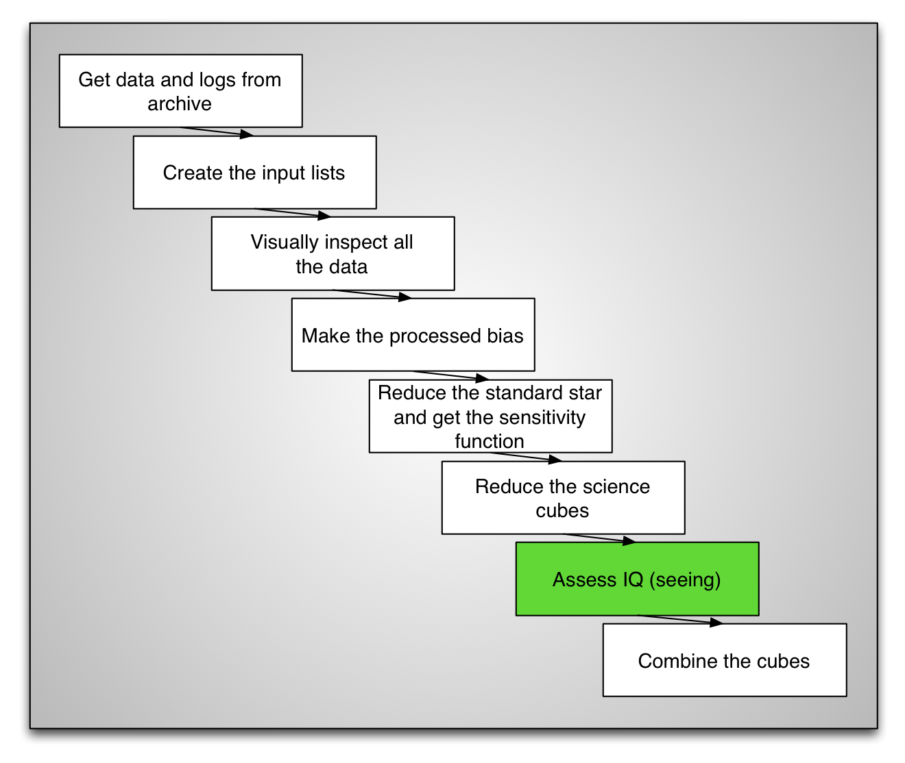
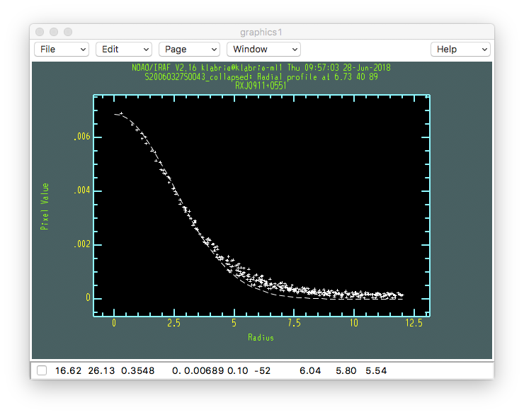

.. iqassessment.rst

.. _iqassessment:

***************************
Assessing the image quality
***************************

Now that we have a calibrated cube, corrected for differential atmospheric
refraction (DAR) we can assess the image quality.  The two things we will
look at are:

1) Whether or not all the sources are in the field-of-view at all
   wavelengths.  If the DAR is important and the source is on the edge of
   the field-of-view, the blue end might fall off it.

2) The seeing.  Obviously, one needs a point source for that.

Inspect along wavelength axis
=============================

A good way to check whether the sources are in the FOV at all wavelength
is to run a little movie that displays thick slices along the wavelength
axis.  To do that here, we use Python.  You can copy and paste this into
your PyRAF session.

The first image is a whitelight image, then the movie starts with
wavelength slices 10-pixel thick.  Notice at the beginning (blue) of
the movie how close the top-left source is to the edge.  Aperture
photometry probably would not work well on that source.  PSF photometry
would do fine since there is enough of the source to fit a good
PSF model.

::

    import astropy.io.fits as fits
    import numpy as np
    import imexam
    import time

    display = imexam.connect(list(imexam.list_active_ds9())[0])

    for sci in iraf.type('sci.lis', Stdout=1):
        sci = sci.strip()
        cube = fits.open('cstxeqxbrg'+sci+'_3D.fits')
        im = np.add.reduce(cube[1].data[500:,:,:])
        display.view(im)
        display.scale('zscale')
        time.sleep(10)
        for position in range(0, cube[1].data.shape[0], 10):
            slice = np.add.reduce(cube[1].data[position:position+10,:,:])
            display.view(slice)

Seeing
======
To measure the seeing we need to "collapse" the cube along the wavelength
axis to create a "whitelight" image.  Then we can use IRAF ``imexamine``
to fit either a Moffat or Gaussian profile to measure the
Full Width at Half Maximum (FWHM) or seeing.

If you have several cubes, especially if taken on different nights, it is
important to verify the seeing.  It is likely that you will not want to combine
good seeing cubes with bad seeing cubes.  Of course that depends on your
scientific objectives.

It is possible to quickly collapse the cube with the IRAF task ``imcombine``.
Below, we specify that we want to collapse the science extension, not the
variance or data quality cubes, then we also specify that we want to
collapse the wavelength slices starting with slice 500.  The reason here
is simply to ignore the very noisy blue end of the spectrum.

::

    for sci in iraf.type('sci.lis', Stdout=1):
        sci = sci.strip()
        iraf.imdelete(sci+'_collapsed')
        iraf.imcombine('cstxeqxbrg'+sci+'_3D.fits[sci,1][*,*,500:6281]',
                sci+'_collapsed', project='yes')

We measure the FWHM with IRAF ``imexamine``.

::

    for sci in iraf.type('sci.lis', Stdout=1):
        sci = sci.strip()
        iraf.imexamine(sci+'_collapsed', 1)

1) To get a radius plot (recommended), point the cursor at the center
   of the top-left source and type "``r``".

2) If the fit looks good (dash line), you can type "``a``" to get the same
   information but with column headers so you can tell what the numbers are.

3) If the Moffat fit "does not converge", you can switch the fit function
   to a gaussian profile by typing "``:``" then "``fittype gaussian``" at the
   prompt.  To switch back to Moffat "``:``" followed by "``fittype moffat``".

Here we find that the Gaussian fit gives us a seeing of 0.58 arcseconds
(FWHM = 5.81, pixel scale = 0.1"/pixel).

