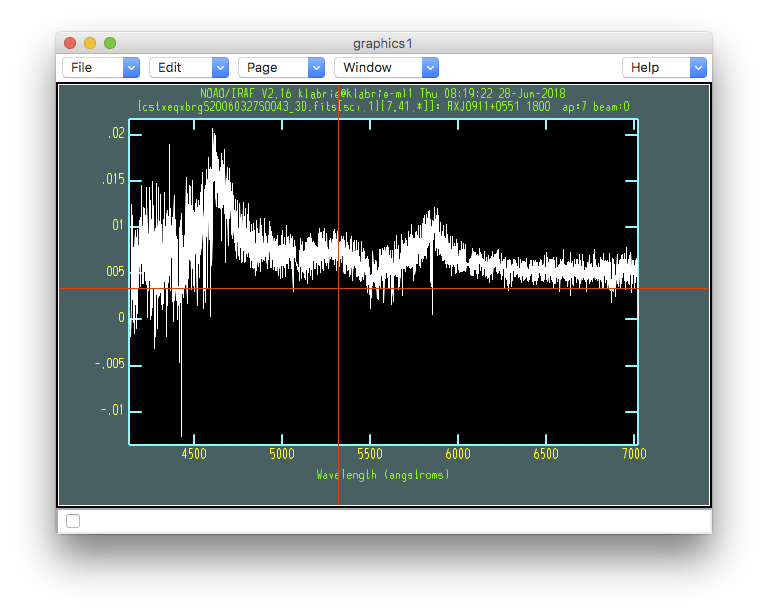

.. makecube.rst

.. _makecube:

****************
Create the cubes
****************
.. image:: _graphics/GMOSIFU-ProcessChart_Science.png
   :scale: 20%
   :align: right

Finally!  We are ready to make a cube of our science data.  The task to
use is ``gfcube``.  This routine will resample of the fibers into a 3-D
data structure with the spatial coordinates on the x and y axis, and the
wavelength on the z (depth) axis of the cube.  The spatial pixel scale
is by default 0.1 arcsecond per pixel.

During the resampling, an atmospheric model will be apply to correct for
differential atmospheric refraction.

Note on the image below the elongation of the top source.  This is supposed to be a point
source.  It is supposed to be round.  The elongation is due to the
differential atmospheric refraction.  The blue light and the red light
were not in the same position in the sky.  GMOS does not have an ADC,
an Atmospheric Dispersion Compensator.  In the most extreme cases, or
when this effect is not taken into account when considering the centering
of the target, the blue light can fall completely off the field-of-view.

To tell ``gfcube`` to apply a corrective model for the atmospheric
dispersion, set ``fl_atmdisp='yes'``.

::

    for sci in iraf.type('sci.lis', Stdout=1):
        sci = sci.strip()
        iraf.imdelete('cstxeqxbrg'+sci+'_3D', verify='no')
        iraf.gfcube('cstxeqxbrg'+sci,
               outimage='cstxeqxbrg'+sci+'_3D', fl_atmdisp='yes', \
               fl_var='yes', fl_dq='yes')

Below is a "whitelight" image of the cube (all the wavelength slices added up).
As you can see the top-left source is a nice circular point source now thanks
to the in-software atmospheric dispersion compensation.

For completeness, here is how one can display a slice of the cube, followed
by how to plot the spectrum at a specific location.

This displays the image at wavelength position (pixel units) 3000.

::

    display cstxeqxbrgS20060327S0043_3D.fits[sci,1][*,*,3000] 1

This plots the spectrum at x,y position 7, 41 (the center of the top-left
source.)

::

    splot cstxeqxbrgS20060327S0043_3D.fits[sci,1][7,41,*]

(Type "``q``" to quit ``splot``.)

