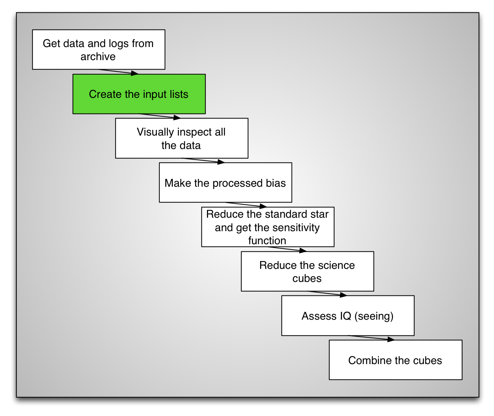

.. makelist.rst

.. _makelist:

***************************
Create the input file lists
***************************

Now that we have identified the data we need and downloaded it from the
archive, we can create input file lists that we will feed to the IRAF
tasks rather than having to type all the input files again and again.
Using lists will also allow us to automated several tedious bookkeeping
tasks later on.

Gemini IRAF offers a task to help us create those lists: ``gemlist`` in the
package ``gemtools``.  Let's do it.

Change to redux directory
=========================
Make sure you are in the ``redux`` directory.  This is where we work from
now on.

::

    cd /your/work/directory
    cd redux

Biases
======
Going through the archive, we found that these raw biases are a good match
for our data.  We will use all these to make a master bias.

+------------------------+----------------------+
| Biases                                        |
+------------------------+----------------------+
| S20060314S             | 91-93                |
+------------------------+----------------------+
| S20060322S             | 157-161              |
+------------------------+----------------------+
| S20060330S             | 58,60-62             |
+------------------------+----------------------+
| Processed bias name: S20060314S0091_bias.fits |
+-----------------------------------------------+

The list is created from that information as follow ::

    gemlist S20060314S 91-93 > bias.lis
    gemlist S20060322S 157-161 >> bias.lis
    gemlist S20060330S 58,60-62 >> bias.lis

Standard Star
=============
Normally, there's only one exposure taken for the standard star.  For some
reason, in this case, four were taken.  After reducing them, it was found
that they are all well exposed so anyone of them could be used.  The third
one is used in this tutorial simply because it's the one with the best
signal.

In this tutorial, we do not cover the reduction of the standard in the
interest of time.  Though we will show how to get the sensitivity function
from the reduced standard star.

For an overview of the standard star reduction, see the diagram in Appendix A.

From the archive search, we found these data for the standard star and its
calibration files.

+--------------+------------------------+-----------------------+
| Standard Star                                                 |
+--------------+------------------------+-----------------------+
| Std Star     | S20060331S             | 53-56                 |
+--------------+------------------------+-----------------------+
| Flat         | S20060331S             | 57                    |
+--------------+------------------------+-----------------------+
| Arc          | S20060329S             | 45                    |
+--------------+------------------------+-----------------------+
| Produced sensitivity function: ltt4364_629_20060331_sens.fits |
+--------------+------------------------+-----------------------+
| In this tutorial the sensitivity function is derived from     |
| ``S20060331S0055.fits``.                                      |
+--------------+------------------------+-----------------------+

Because we will not reduce the standard star and rather just focus on the steps
specific to the sensitivity function, this is the only list we will need::

    gemlist S20060331S 55 > std.lis

If you were to reduce the standard star fully, you would create a list for
the flat and for the arc, like we do below for the science data.

Science Exposures
=================
In the table below is a subset of that source's observation sequence.  We will
work with only two cubes.  In fact, in the interest of time we will reduce only
one, the second is already reduced and provided to you for the last steps:
the IQ assessment and the cubes stacking.

We use lists for the science exposures, which makes sense since normally we
do reduce several exposures, but we will use lists for the single flat and
the single arc too.  The idea is to keep the data reduction commands as
generic as possible to simplify re-use of these instructions.  If you want
to use the instructions for your data, just generate the appropriate lists
and for most commands, there won't be a need to modify anything.

+--------------+------------------------+--------------------+
| Science Observation                                        |
+--------------+------------------------+--------------------+
| Science      | S20060327S             | 43,45              |
+--------------+------------------------+--------------------+
| Flat         | S20060327S             | 44                 |
+--------------+------------------------+--------------------+
| Arc          | S20060329S             | 45                 |
+--------------+------------------------+--------------------+
| Using bias: S20060314S0091_bias.fits                       |
+--------------+------------------------+--------------------+
| Using sensitivity function: ltt4364_629_20060331_sens.fits |
+--------------+------------------------+--------------------+

Generating the lists.  (We do not add image 45 in the interest of time, normally
you would.) ::

    gemlist S20060327S 43 > sci.lis
    gemlist S20060327S 44 > flat.lis
    gemlist S20060329S 45 > arc.lis

We are now good to go!

.. note::

    In PyRAF programming syntax, the ``gemlist`` call would look like
    this:  ``gemlist('S20060327S', '43', Stdout='sci.lis')``.  This syntax is used
    when wrapping with Python, or when wanting to use variables.  We will be using
    that syntax for the rest of the tutorial.

