.. mdf.rst

.. _mdf:

**************
Verify the MDF
**************

.. image:: _graphics/GMOSIFU-ProcessChart_Science.png
   :scale: 20%
   :align: right

.. image:: _graphics/GMOSIFU-DRChart_MDF.png
   :scale: 20%
   :align: right

The mapping of the fibers, how many there are, from which bundle they are from, which
ones are dead, is all contained in the MDF, the Mask Definition File that is
found in the Gemini IRAF package.

Most of the time, the default MDF will work just fine.  But there are those
rare occasions where a fiber gets vignetted or something is affecting a fiber
and just like that the MDF does not match the data anymore.  This will
throw the automatic fiber identification off, along with the extraction.  Nothing
is going to crash, but an hour later you will look at some extracted data and be
really puzzled by what you see.  Our recommendation is to spend 10 minutes and
verify the MDF before you proceed, and fix it, if needed.

Here we will show how to spot the problem, then we will show you how to correct it.

Verify the MDF
==============

The GMOS IFU MDFs are located in ``gmos$data``.  We will pick the one that
matches the CCDs and copy it over.  Here is the complete list::

    dir gmos$data/*ifu*.fits ncols=1

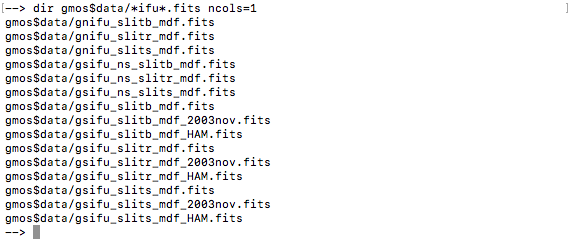

.. role:: strike

The data we are reducing is from GMOS-South ("``gs``") with the
EEV CCDs (not ":strike:`HAM`"). The data is from 2006 (not ":strike:`2003nov`")
and taken with the IFU "red" slit ("``slitr``").  The MDF that matches is:
``gsifu_slitr_mdf.fits``.

Note that the software can automatically select the correct MDF.  But since
we might need to edit it, we need to copy it over to our work directory.

Set variables
-------------
We set the variables here, then the rest of the commands don't have to be
modified.

::

    mdf = 'gsifu_slitr_mdf.fits'
    bias = '../calibrations/S20060314S0091_bias.fits'
    flat = iraf.head('flat.lis', nlines=1, Stdout=1)[0].strip()

    rawdir = rawdir = '../tutorial_data/'

Copy the MDF
------------
We copy the selected MDF to the current directory::

    iraf.copy('gmos$data/'+mdf, '.', verbose='no')

Extract a flat
--------------
We use a flat to check the MDF because in a flat all good fibers are fully
illuminated.

We first bias and overscan-subtract the flat, and we attached the unmodified
MDF.

::

    imdelete('g@flat.lis')
    imdelete('rg@flat.lis')

    gfreduce(flat, rawpath=rawdir, fl_extract='no', bias=bias, \
             fl_over='yes', fl_trim='yes', mdffile=mdf, mdfdir='./', \
             slits='red', fl_fluxcal='no', fl_gscrrej='no', \
             fl_wavtran='no', fl_skysub='no', fl_inter='no', fl_vardq='no')

Now we extract the flat with the unmodified MDF in interactive mode to
verify whether or not the fibers are identified correctly.  The key here
is to remember what we learned earlier: a fiber bundle has 50 fibers...
Let's see how it looks.

::

    imdelete('erg@flat.lis')

    gfextract('rg'+flat, fl_inter='yes')

::

    - Answer 'yes' to the "Find apertures" question.
    - Answer 'yes' to the "Edit apertures" question.

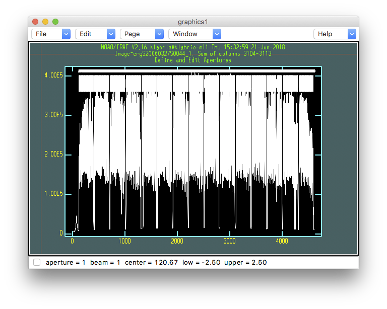

Identify missing fibers
-----------------------
What we need to inspect is the fiber numbering around the bundle gaps.  Each
bundle is 50 fibers.  Therefore, at each gap, the last fiber of a bundle must
identified with a number that is a factor of 50, eg. 150, 300, and the first
fiber of a bundle but be the +1 fiber, eg. 151, 301.

To zoom in, the interactive commands are "``w``", followed by "``e``-``e``" to
defined the lower-left and upper-right corners.  "``w``" and "``a``" to zoom back
out.

Here is the first bundle gap.  The last fiber of bundle 1 is 50, the first
fiber of bundle 2 is 51.  That's good!

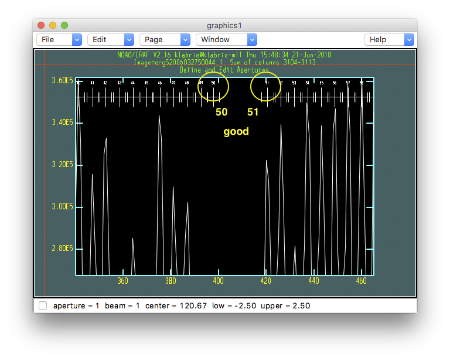

Let's go through the whole plot and check the other bundle gaps.  You can
skip a few, but you do always want to check the last bundle gap.

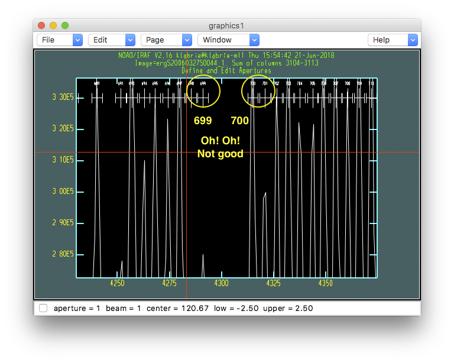

That second last bundle ends with fiber number 699 and the next bundle starts
with 700.  It should be end with 700, start with 701.  This tells us that
**one fiber is missing** before that last bundle gap.  We need to find it.

For now we know that it is located between bundle 1 and 15.  We can look at
the full window to maybe spot a bundle with a "hole" in it.

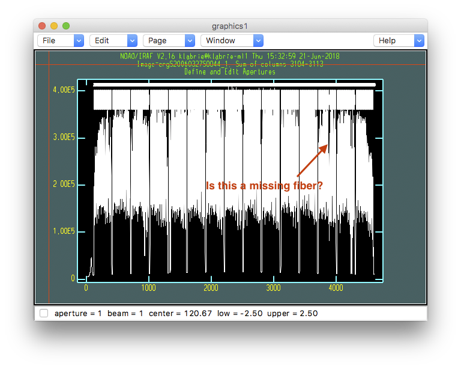

Let's zoom in.  Again use the "``w``-``e``-``e``" interactive commands.

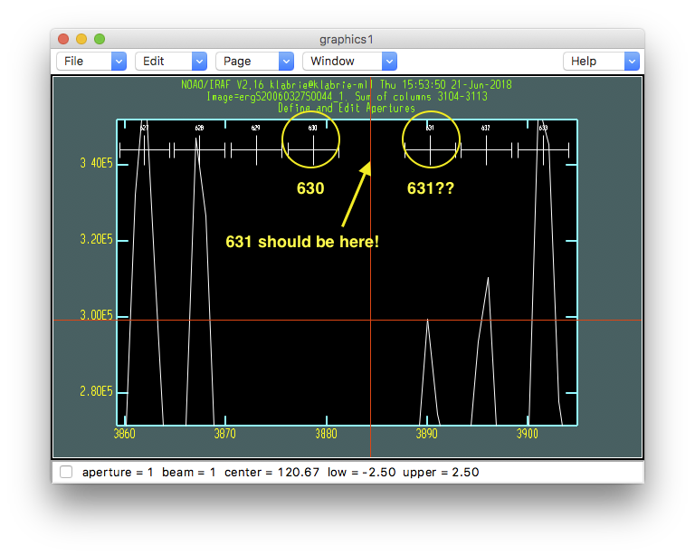

Fiber 631 is missing.  The software identify fiber 630, there's a "hole" and
the next fiber is identified as 631, but it really should be 632 since 631
is the missing fiber, the "hole".  In the MDF, we need to set fiber 631 as
missing.  We do that in the next section.

Finding a missing fiber, or multiple missing fibers, is not always this easy.
Sometimes, it is necessary to look at many bundle gaps to spot the bundle
with the missing fiber.  When more than one fiber is missing, it is even
more tricky to correctly identify which fibers need "turning off" in the MDF.
Then, once we have a possible solution, we need to try it out and inspect
the fiber identification again, and possibly again, and again, until the identification
comes out clean.

This is mostly just a heads-up, it is not a frequent occurrence but it is
critical to understand the problem and know how to fix it, which is why we focus
on it here.

Let's get out of the extraction routine.  There is no point in extracting
this since we know there's a problem with the identification.  So,

.. code-block:: text

    - Type "q" to get out of the plot
    - Answer "NO" (uppercase) to all the questions.

Fix it!
=======

Update the MDF
--------------
The MDF is stored as FITS binary table.  In IRAF, to check the content
of a FITS table, there is the task ``tread``.

::

    tread(mdf)

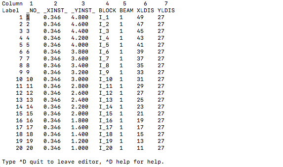

The info in this file is used for the extraction and for
the image reconstruction.  The column we are interested in right now is the
``BEAM`` column.  When the value is ``1``, the fiber is "good" or "present".
When the value is ``-1``, the fiber is missing and should be ignored during
the extraction step.

In our case, to fix our MDF, we need to give fiber 631 a ``BEAM`` value of
``-1``.  We use the ``tcalc`` IRAF task.  (Exit ``tread`` first by typing
``^D quit``.)

::

    tcalc(mdf, 'BEAM', 'if NO == 631 then -1 else BEAM')

This command says: Go through the table, if ``NO`` is ``631`` set ``BEAM`` to
``-1``, for every other ``NO``, just keep the ``BEAM`` value.

Verify the MDF again
--------------------
Now we can attempt the extraction again but with the modified MDF.

In principle, here we just need to replace the bad MDF attached to the
pre-extraction file (``rg`` prefix).  But doing so involves deleting the
bad MDF, appending the new MDF, then not forgetting to add ``EXTNAME`` and
``EXTVER``, and maybe other things.  The simplest thing to do is just to
re-reduce the flat. The bias and overscan correction are quite fast.
A few extra seconds to wait in favor of simplicity.

::

    imdelete('g@flat.lis')
    imdelete('rg@flat.lis')

    gfreduce(flat, rawpath=rawdir, fl_extract='no', bias=bias, \
             fl_over='yes', fl_trim='yes', mdffile=mdf, mdfdir='./', \
             slits='red', fl_fluxcal='no', fl_gscrrej='no', \
             fl_wavtran='no', fl_skysub='no', fl_inter='no', fl_vardq='no')

::

    imdelete('erg@flat.lis')

    gfextract('rg'+flat, fl_inter='yes')

If we zoom in on fiber 631's expected location, now we see that it is correctly
ignored in the fiber identification.

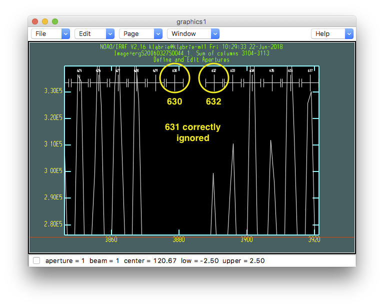

Zooming in on the last gap, the one that indicated there was a problem, now
we see a normal gap, ending with 700, starting with 701.  Our MDF is now
fixed!

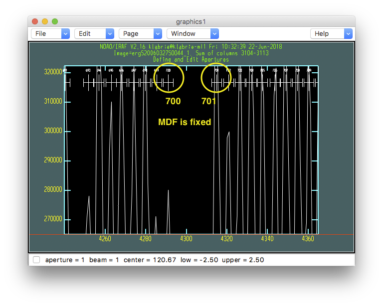

Now that we have a good MDF, we are on our way to a good extraction.  We
could simply continue the interactive extraction, but that leads to a series
of yes or no questions that can be error prone.  So, let us for now just
exit with a series of "NO" like we did above, and re-run the extraction
non-interactively (next chapter).

.. code-block:: text

    - Type "q" to quit the interactive plot.
    - Answer "NO" (uppercase) to every question.

If not fixed...
===============
Before we move on, there is another way to *maybe* spot that the extraction
is not being done properly.  Later on, in the scattered light subtraction
step, the bundle gaps position are being estimated.  The positions will be
displayed on the screen.

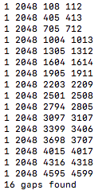

Notice how the third from last gap and the next one have a y-interval of only 3
pixels while the previous ones 6 to 11 pixel wide. That's a sign.  Also,
if you display non-extracted image and compare those gaps with the gaps on
the image, you will see that gaps after the missing fiber do not match.

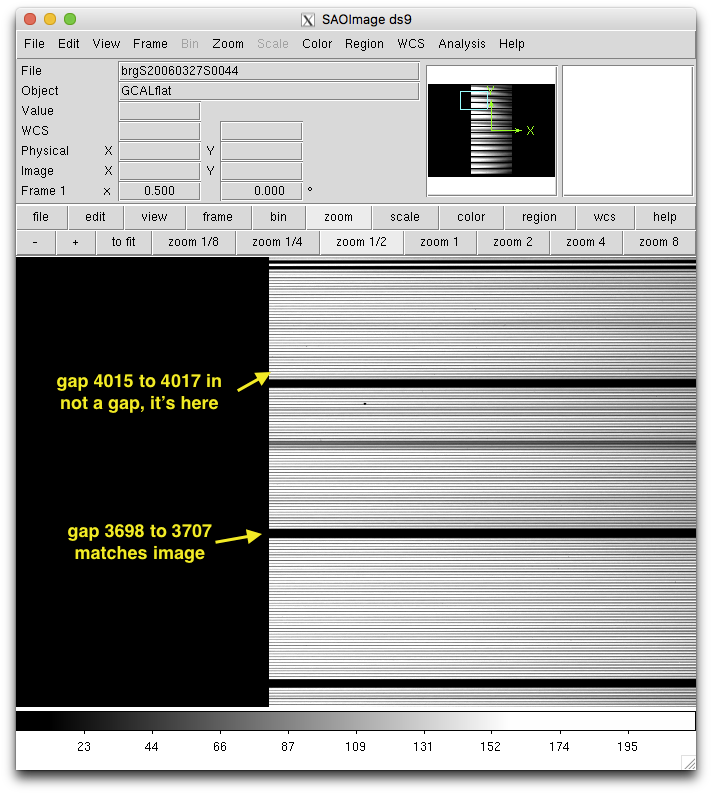

