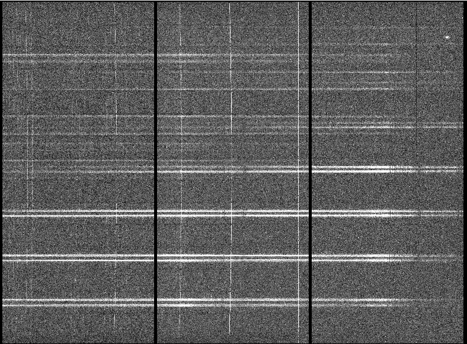
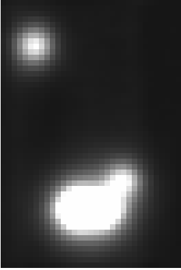

.. objectives.rst

.. _objectives:

*******************
Learning objectives
*******************

This tutorial is calibrated for people new to GMOS IFU data reduction.
Some troubleshooting examples can certainly be of interest to more
experienced users.

Some basic knowledge of IRAF is expected, but mostly to avoid being distracted
by it. The focus will be put on reducing the IFU data, not how to use IRAF.
Python is used throughout for variable settings, and for one pre-written
convenience function.  The reader is not expected to code in Python.

Expected Duration of Live Tutorial:  4 hours.

----

In this tutorial, the reader will:

* Learn how to use the Gemini Observatory Archive to retrieve the data and
  necessary calibration files.  ??? remove if I run out of time to write that
  part of the tutorial.
* Learn the standard way to reduce GMOS IFU-1 data.
* Learn how to complete certain data sensitive steps interactively for better
  results.
* Learn how to detect certain data reduction issues and how to fix them.
    * Fix an MDF for vignetted fibers
    * Interactively do the arc line identification when the automatic algoritm fails.

This tutorial will not make you an expert at GMOS IFU data reduction.  It will
however give you a good foundation onto which to grow your knowledge.  For some
program, depending on the source characteristics and the scientific objectives,
the instructions from this tutorial might be sufficient.

