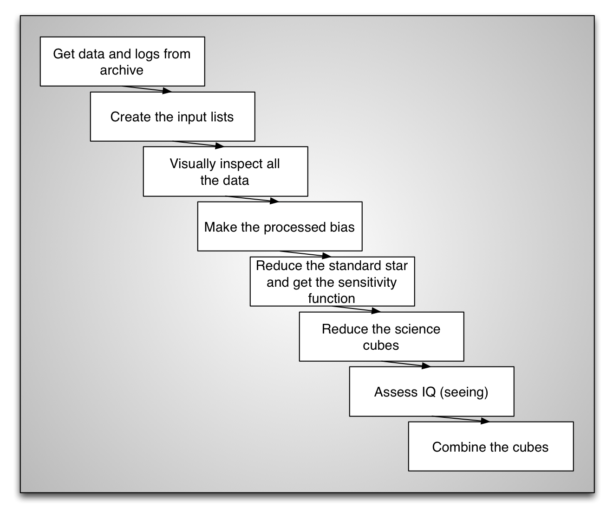
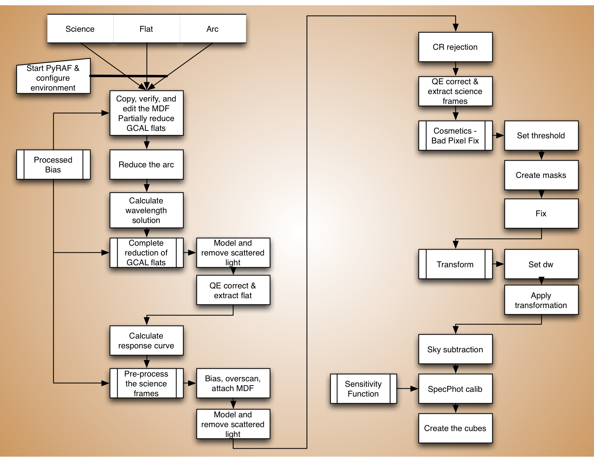

.. overview.rst

.. _overview:

***********************
Overview of the process
***********************

From beginning to end
=====================
The diagram below is the very top level view of everything that needs to be
done, and what we will cover in this tutorial, from
getting the data from the archive to combining several cubes together to
produce the final product.

Science reduction chart
=======================
This next diagram explains in more details the steps specific to the reduction
of a science exposure, from raw to calibrated cube.

We will keep referring to these charts as we move through this tutorial.
