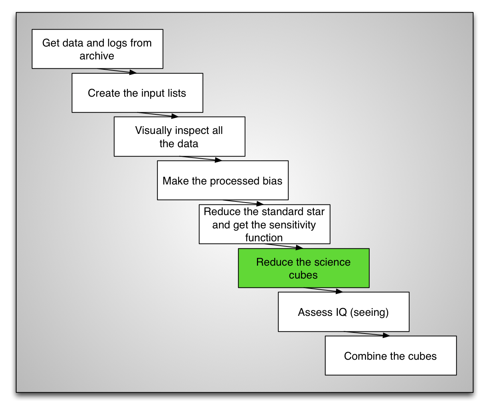
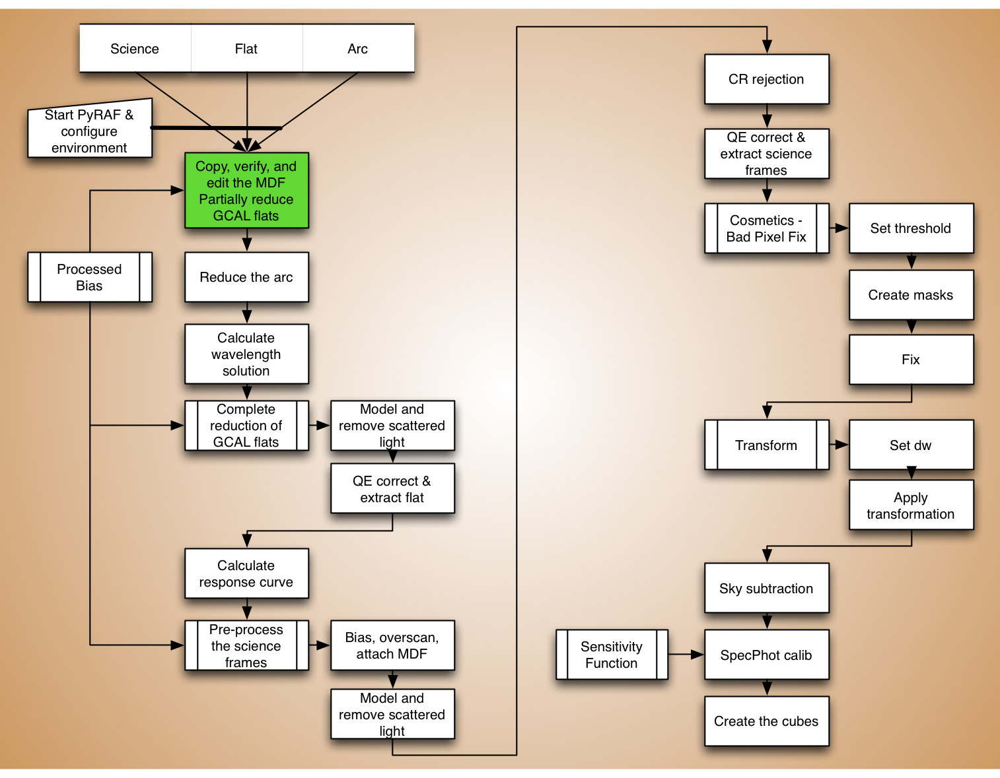
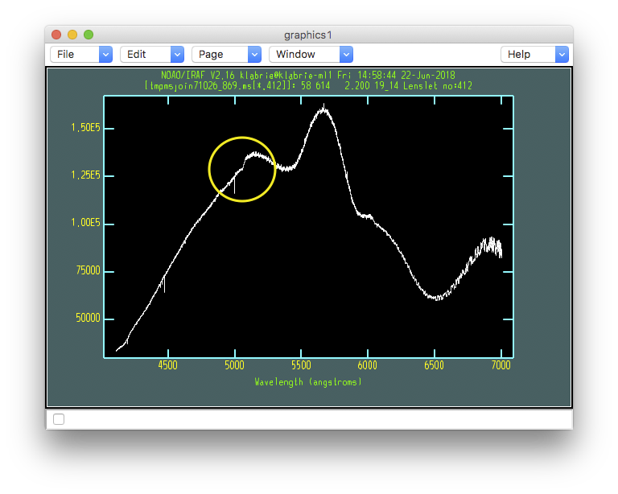

.. preprocflat.rst

.. _preprocflat:

***************
Trace reference
***************

The flat field is the only exposure where all the fibers are well illuminated.
It is uses to define the position of the light on the detector.  This
information is needed to extract the arc spectra.  A reference flat is also
needed identify the position of the bundle gaps.

For the science reduction, the flat needs to have been corrected for
differences in quantum efficiency between the chips.  This is wavelength
dependent. So, we need the flat for the wavelength calibration but we need
to the wavelength calibration to produce the science flat.

This circular requirement forces us to first reduce the flat without the
QE correction and use that as reference to extract the arc and calculate
the wavelength solution.  Then we throw it away and reduce it again, this
time with the wavelength solution and a QE correction.

Let us call this first flat a "trace reference".  It will not be used to
flat field anything, but it is needed nonetheless.

As we have done before, let us first set some key variables.

::

    mdf = 'gsifu_slitr_mdf.fits'
    bias = '../calibrations/S20060314S0091_bias.fits'
    rawdir = '../tutorial_data/'

Then we call ``gfreduce`` to do the bias and overscan correction, and
the extraction (``fl_extract='yes'``).  We use our modified MDF.  There
is no need for the interactive mode.  This step takes a few minutes to run.

.. 5 minutes

::

    imdelete('g@flat.lis')
    imdelete('rg@flat.lis')
    imdelete('erg@flat.lis')

    gfreduce(flat, rawpath=rawdir, fl_extract='yes', bias=bias, \
             fl_over='yes', slits='red', mdffile=mdf, mdfdir='./', \
             fl_fluxcal='no', fl_gscrrej='no', fl_wavtran='no', \
             fl_skysub='no', fl_inter='no', fl_vardq='yes')

We can check the extracted spectra with ``gfdisplay``.  Once the reconstructed
image shows up, put the cursor on any hexagon and press the <space> bar,
a spectrum plot will show up.  Notice the big jump around 5100 Angstrom.  That
location is where two CCDs meet.  That jump is due to difference in quantum
efficiency.  Clearly, we would not want to use this flat as a flat field.  It
will do fine as a *trace reference* however.

::

    for flat in iraf.type('flat.lis', Stdout=1):
        flat = flat.strip()
        iraf.gfdisplay('erg'+flat, 1, version='1')

.. code-block:: text

    - Hit <space> with the pointer on an hexagon.

