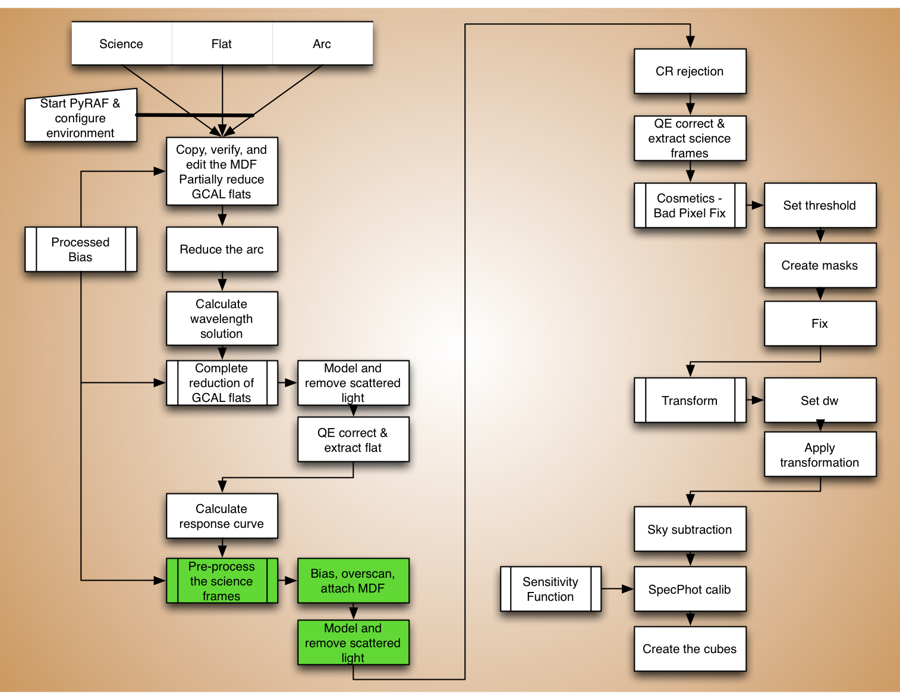
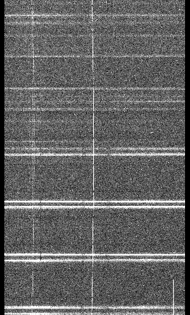
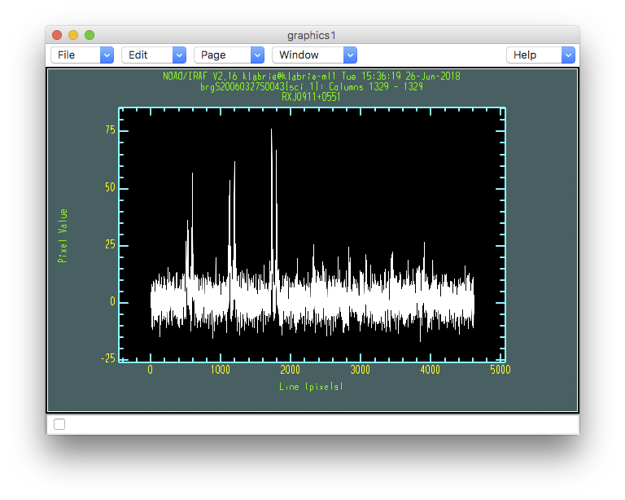
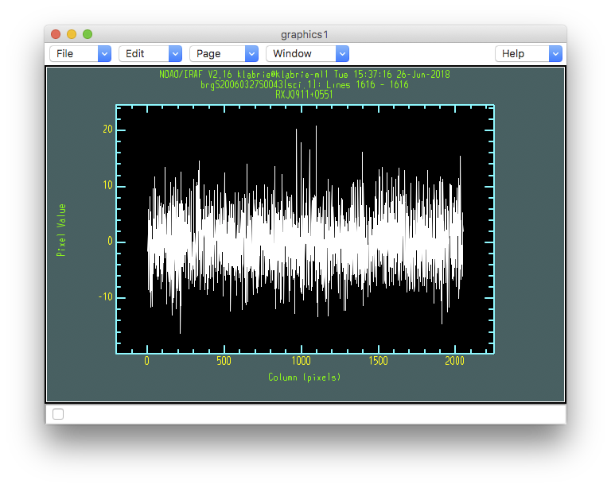

.. preprocscience.rst

.. _preprocscience:

************************************
Pre-processing of the science frames
************************************
.. image:: _graphics/GMOSIFU-ProcessChart_Science.png
   :scale: 20%
   :align: right

We are finally able to start reducing the science frames.  Here we will
attach a MDF, remove the bias and the overscan, then model and remove
the scattered light.

We will stop there because the next step is to remove the cosmic rays
and we want to do that on an "non-extracted" frame.

MDF, bias and overscan
======================
Let us run ``gfreduce`` on the science frame to attach the MDF, and correct
for bias and overscan.  We have done this for the flat earlier so it should
feel familiar.

|
|
|

::

    rawdir = '../tutorial_data/'
    mdf = 'gsifu_slitr_mdf.fits'
    procbias = '../calibrations/S20060314S0091_bias.fits'

::

    imdelete('g@sci.lis')
    imdelete('rg@sci.lis')

    gfreduce('@sci.lis', rawpath=rawdir, fl_extract='no', \
             bias=procbias, fl_over='yes', slits='red', mdffile=mdf, \
             mdfdir='./', fl_fluxcal='no', fl_gscrrej='no', \
             fl_wavtran='no', fl_skysub='no', fl_vardq='yes', \
             fl_inter='no')

Scattered light
===============
Again, another familiar step. We will apply the same steps and principle
to the science frame as we did for the flat when we removed the scattered
light.

The scattered light is normally weak in the science frame because the
target is normally faint.  But the signal is still there. It is easy
enough to fit and remove it.  One just has to be careful not to make it
worse; for example, really do avoid any flaring or extreme values.  (See
the chapter on the flat reduction for a full discussion, :ref:`flat`.)

One difference with the science frame is that the signal is too weak to
allow the identification of the inter-bundle gaps.  But we have already
done that with the flat.  We can use the solution obtained from the
flat to run ``gfscatsub`` on the science.

::

    imdelete('brg@sci.lis')

    flatref = iraf.head('flat.lis', nlines=1, Stdout=1)[0].strip()

    for sci in iraf.type('sci.lis', Stdout=1):
        sci = sci.strip()
        iraf.gfscatsub('rg'+sci, 'blkmask_'+flatref, prefix='b', \
                  outimage='', xorder='3,3,3', yorder='3,3,3', \
                  cross='yes', fl_inter='yes')

In this case, unlike for the flat, our starting value of 3 for the order works
well for all three extensions.  Let us nevertheless make sure the gaps to to
zero flux.

::

    for sci in iraf.type('sci.lis', Stdout=1):
        sci = sci.strip()
        for i in range(3):
            iraf.imexamine('brg'+sci+'[sci,'+str(i+1)+']', 1)

.. code-block:: text

    - Type "c" for column plots.
    - Type "l" for line plots of the gaps.
    - Type "q" to quit and go to the next extension.

