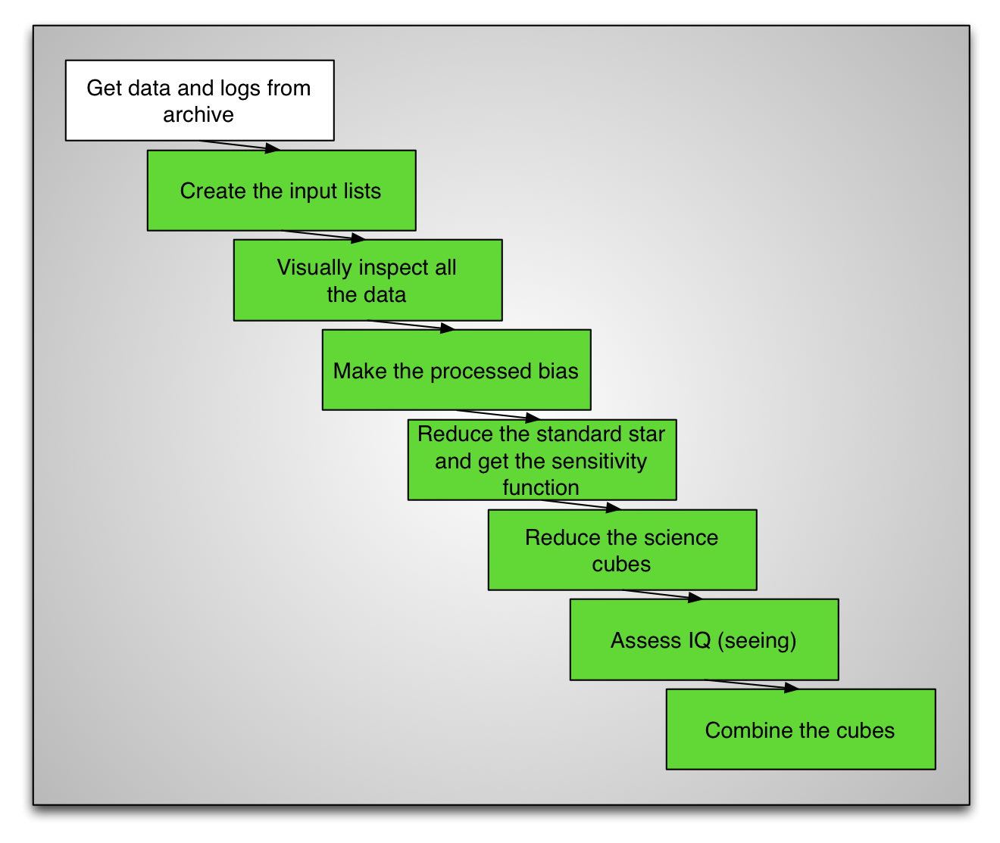
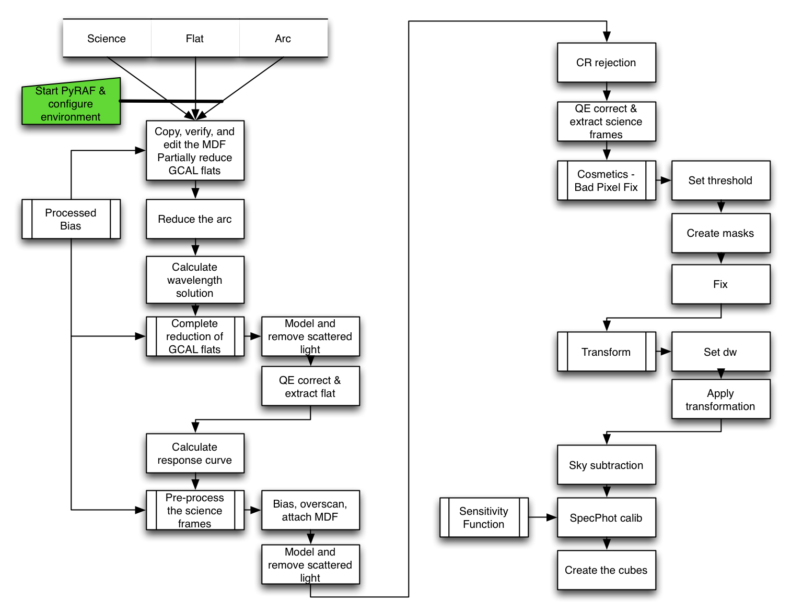

.. pyrafconfig.rst

.. _pyrafconfig:

***********
Start PyRAF
***********

Let's start PyRAF and get some basic configuration done.

First, we need to activate the anaconda environment that holds IRAF, PyRAF,
and the Gemini software.  Then we can go to our work directory, launch the
image display ``ds9`` and launch the PyRAF session.  This is all done from
the ``bash`` shell.

::

    /bin/bash -l

::

    source activate geminiconda
    cd /your/work/directory

    ds9&
    pyraf

Now we are in the PyRAF session.  We need to load the ``gemini`` package and
the ``gmos`` package.  Then the standard image buffer needs to be set.  (If
you forget, ``gdisplay`` will remind you.  If you followed the installation
instructions, IRAF should already be aware of ``pyfu`` and ``lacos_spec.cl``
thanks to the definitions that were added to the ``loginuser.cl`` file.

.. Then make IRAF aware of the
.. ``pyfu`` package that we added, and of the ``lacos_spec.cl`` script.

::

    gemini
    gmos
    set stdimage=imtgmos

..  #reset pyfu = "iraf/pyfu/"
..  #task pyfu.pkg = pyfu$pyfu.cl
..  #task lacos_spec = "iraf/lacos_spec.cl"

