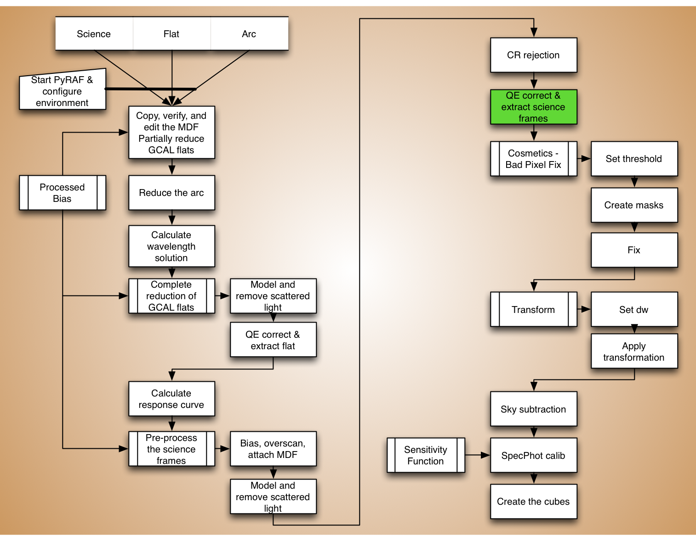
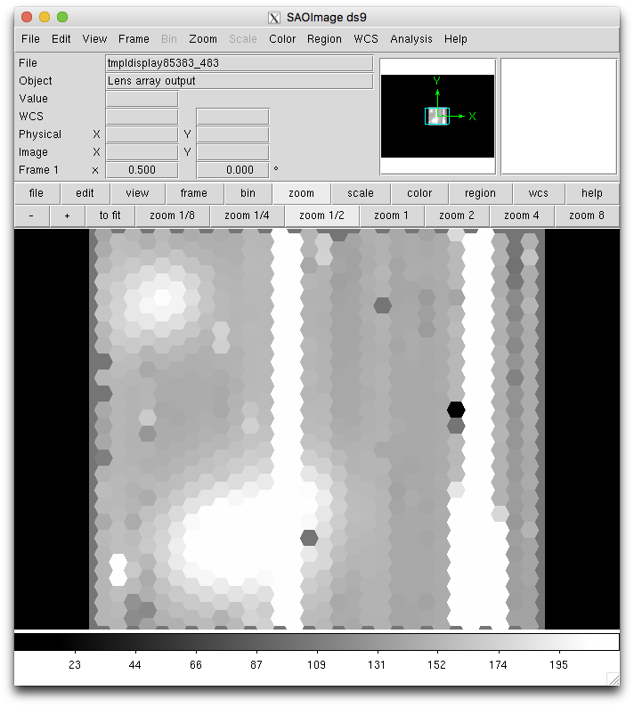
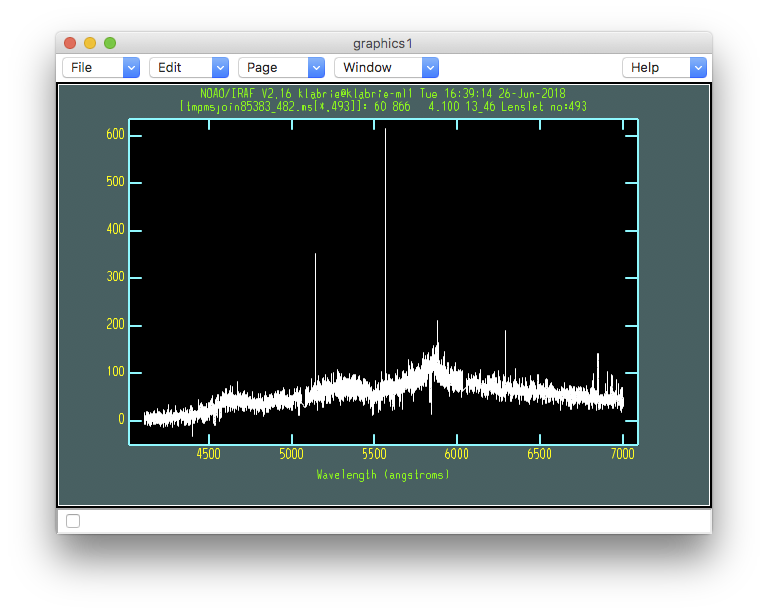

.. qeextractscience.rst

.. _qeextractscience:

*******************************************
QE correction and extraction of the science
*******************************************
.. image:: _graphics/GMOSIFU-ProcessChart_Science.png
   :scale: 20%
   :align: right

We now correct the science frame for quantum efficiency effects and
extract it.  We use the arc for the QE correction, and we apply the
response function during the extraction.  Also, the extracted flat is used
as a trace reference.

|
|
|
|
|
|
|
|
|
|
|
|
|
|

First let us define our variables.

::

    flat = iraf.head('flat.lis', nlines=1, Stdout=1)[0].strip()
    response = flat + '_resp'
    refflat = 'eqbrg' + flat

    arc = iraf.head('arc.lis', nlines=1, Stdout=1)[0].strip()

We correct for QE and complete the extraction of the science spectra.

::

    imdelete('qxbrg@sci.lis')
    imdelete('eqxbrg@sci.lis')

    for sci in iraf.type('sci.lis', Stdout=1):
        sci = sci.strip()
        iraf.gqecorr('xbrg'+sci, refimage='erg'+arc, fl_correct='yes', \
                fl_vardq='yes', verbose='yes')
        iraf.gfextract('qxbrg'+sci, response=response, recenter='no', \
                   trace='no', reference=refflat, weights='none', \
                   fl_vardq='yes')

Let us have a first look at the extracted data.

::

    for sci in iraf.type('sci.lis', Stdout=1):
        sci = sci.strip()
        iraf.gfdisplay('eqxbrg'+sci, 1, version='1')

The big white vertical lines are due to bad columns that heavily affect
two fiber bundles, one target bundle, one sky bundle.  It affects just a
short wavelength range but ``gfdisplay`` just adds up the flux to create the
image and doesn't reject extreme values, hence the nasty artifacts.

Below is the spectrum of the central fiber of the source in the top left
corner.  The thin spikes are sky lines.  We will subtract the sky later.

