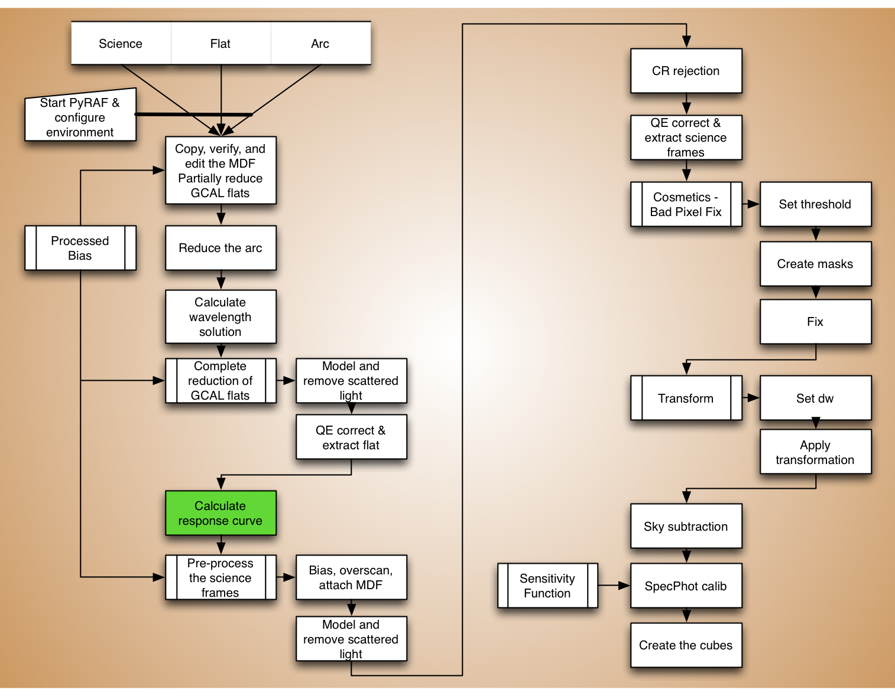
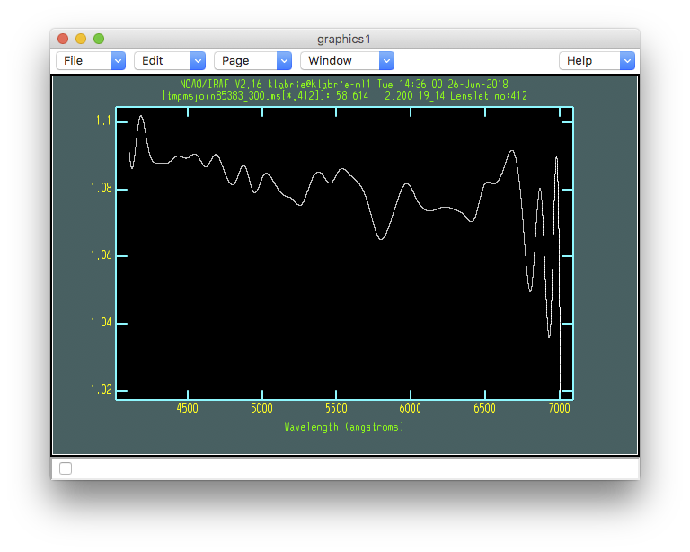

.. response.rst

.. _response:

*******************************
Calculate the response function
*******************************
.. image:: _graphics/GMOSIFU-ProcessChart_Science.png
   :scale: 20%
   :align: right

The response function represents the relative fiber throughputs for the
IFU unit.  It is derived from the flat field.

A twilight can be used to
ensure the flatness of the field of view, however that twilight needs to
be obtained at the same position and elevation as the target to match the
flexure.  That is rarely the case for the twilight obtained as part of the
Gemini Baseline Calibration.

Based on experience from several Gemini staff, the twilight has not been
found useful at all.  The GCAL flat is sufficiently flat within the small IFU
field-of-view anyway.

Calculating the response curve is simple and quick.  Note that we do not use
the default value for ``order`` and ``func``.  Setting ``order=45`` and
``func='spline3'`` seem to work better.

|

::

    for flat in iraf.type('flat.lis', Stdout=1):
        flat = flat.strip()
        iraf.imdelete(flat+'_resp')
        iraf.gfresponse('eqbrg'+flat, outimage=flat+'_resp', sky='', \
                        order=45, func='spline3', sample='*', \
                        fl_fit='yes', fl_inter='no')

Let us have a look at it.

::

    for flat in iraf.type('flat.lis', Stdout=1):
        flat = flat.strip()
        iraf.gfdisplay(flat+'_resp', 1, version='1')

::

    - Press <spacebar> to plot the spectrum under the cursor.

The response spectra should always hover around 1 because of the
normalization across all the fibers.