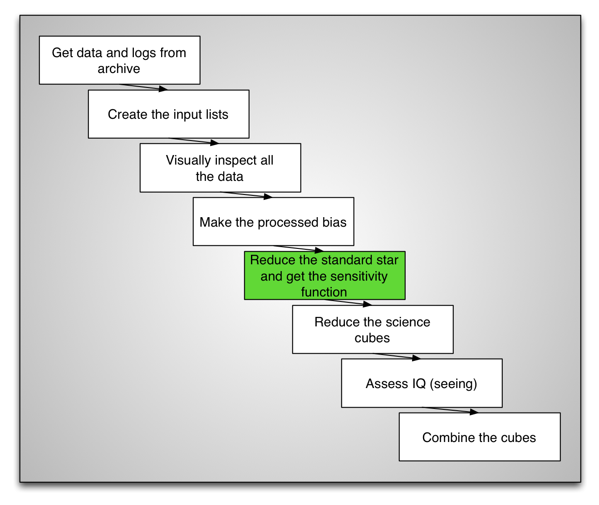
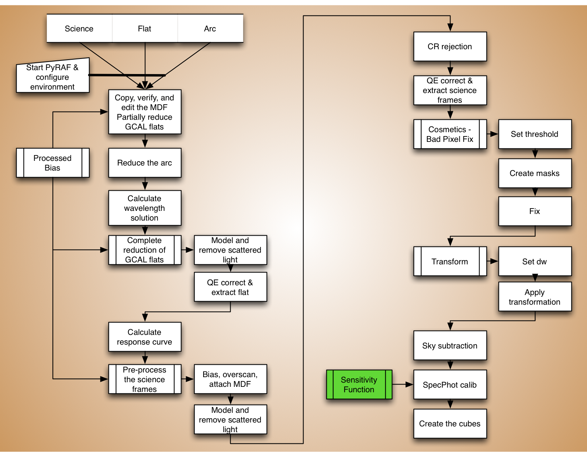
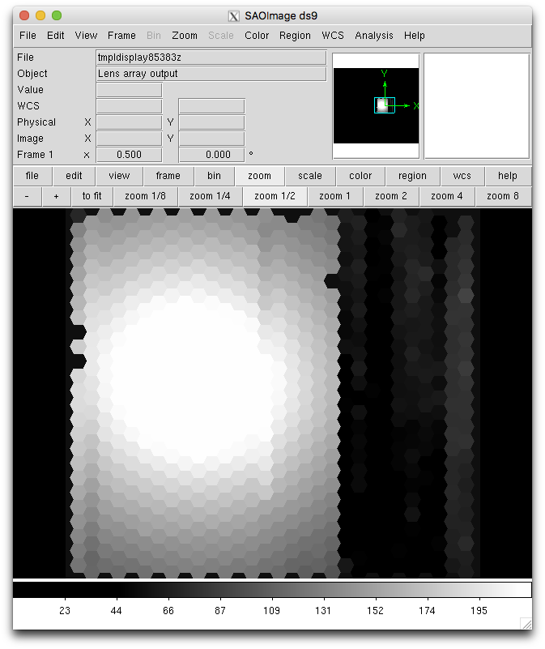
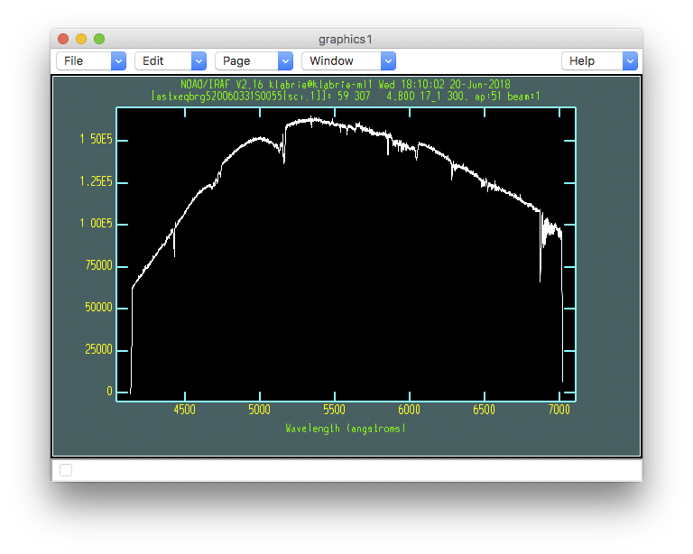
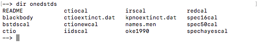
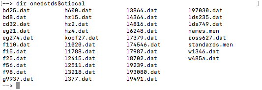
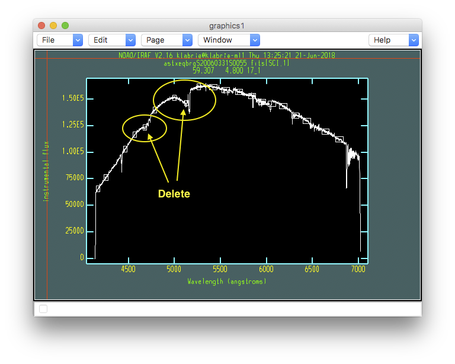
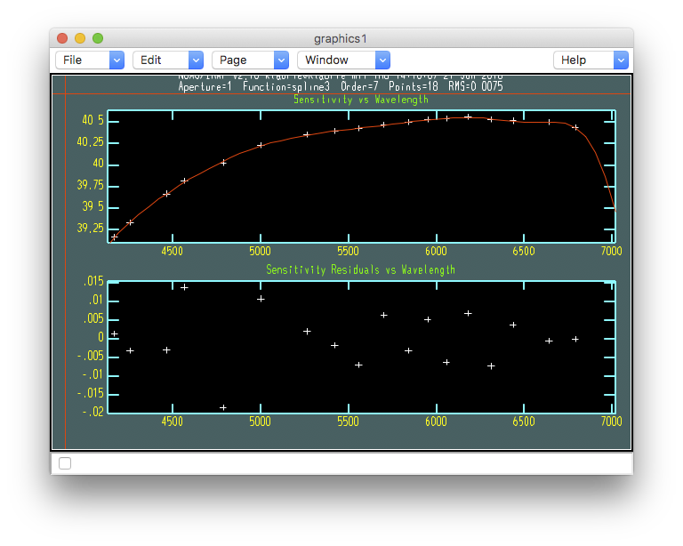
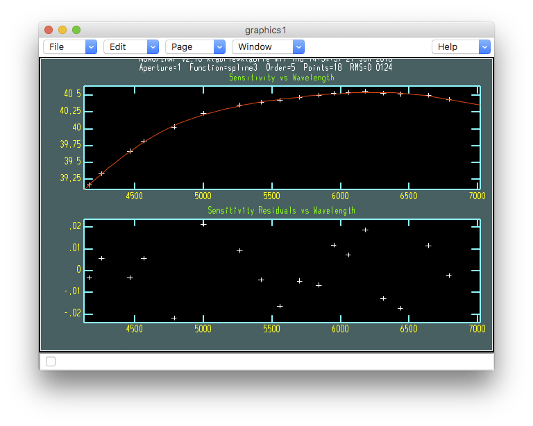

.. sensfunc.rst

.. _sensfunc:

********************
Sensitivity function
********************

The sensitivity function is calculated from the spectrophotometric standard.

In the interest of time, we will skip the reduction of the star standard since
it is essentially the same steps as for the reduction of the science, which we
will cover later.  We refer the reader to Appendix 1, :ref:`standardstar`, for an
overview of the
standard reduction steps.

Here we start with an already reduced standard star exposure and we proceed
to demonstrate the two extra steps that will lead to the sensitivity function.
Let's copy the pre-reduced data over to ``redux``, it is in the
``tutorial_data`` directory.

|
|
|
|

::

    std = iraf.head('std.lis', nlines=1, Stdout=1)[0].strip()
    copy('../tutorial_data/stxeqbrg'+std+'.fits', '.')

Sum the fibers
==============
Each fiber has a spectrum of the star.  In this step we sum them all to
produce one single high signal-to-noise spectrum.  This summing of everything
also helps take away most of the differential atmospheric refraction effect by
effectively using all the light in the aperture regardless of position.
In the picture below, each hexagon represent a fiber, each one is a spectrum.
They will all be summed together.

::

    imdelete('astxeqbrg@std.lis')

    for std in iraf.type('std.lis', Stdout=1):
        iraf.gfapsum('stxeqbrg'+std, combine='sum', fl_inter='no')

Let's have a look a the summed spectrum.

::

    for std in iraf.type('std.lis', Stdout=1):
        std = std.strip()
        iraf.splot('astxeqbrg'+std+'[sci,1]')

This is the shape the telescope and instrument let through.  The real standard
star flux does not fall off like that in the blue.  That's what the
sensitivity function will correct for.

When you are ready to quit the interactive plot, press "``q``".

Calculate the sensitivity function
==================================
In a very simplified picture, the sensitivity function is the difference
between what was recorded and what the star spectrum really should look like.
It is the shape of the spectrum that matters, not the absolute flux.

This sensitivity correction will be applied to our science observations.

Find the star
-------------
So, we need to know what the standard star spectrum looks like.  IRAF
provides wavelength-flux tables for a large collection of common
spectrophotometric standards, for both hemispheres.  Those are located in
the ``onedstds`` directory.  From the PyRAF session::

    dir onedstds

Each of these directories contains flux tables.  The table for our standard
star, LLT 4364, is in the subdirectory ``ctiocal``::

    dir onedstds$ctiocal

The file is named ``l4364.dat``.  It is the ``l4364`` part that we will need
to provide as ``starname`` to ``gsstandard`` below.

Set the input parameters
------------------------
Now that we know in which directory our star flux table is located and what
"name" IRAF uses for it, let's define some variables we will use in the call
to ``gsstandard``.

::

    root_name = 'ltt4364_629_20060331_'
    outflux = root_name+'std'
    sensfunc = root_name+'sens'

    extinction = 'onedstds$ctioextinct.dat'
    caldir = 'onedstds$ctiocal/'
    starname = 'l4364'

    input = iraf.head('std.lis', nlines=1, Stdout=1)[0].strip()

The extinction file is the CTIO site extinction file.  Cerro Tololo and
Cerro Pachon are right next to each other, so that extinction curve is
perfectly adequate for Gemini South (Cerro Pachon).   For Gemini North,
one would use ``gmos$calib/mkoextinct.dat``.

Don't worry too much about the statement that sets the ``input`` variable.
It is making use of IRAF and Python to return the first line in the file.
There's only one line in our current case, but it still need to be read and
assigned to ``input``.   One could also just type the full filename in the
``gsstandard`` command, but we are trying in this tutorial to show how
to minimize the modifications necessary to adapt the tutorial
instructions to a different set of GMOS IFU-1 data.

Call ``gsstandard``
-------------------
We now run the task that will calculate the sensitivity function.
We will run it interactively.  Most of the time this is not necessary but
this dataset has weak signal in the blue and a big absorption feature. It
can throw the fit a bit.
We can correct that interactively.  Even in "normal" cases, it never hurts
to run this step interactively even if just to visually verify that the fit
it proposes is acceptable.

::

    delete(outflux, verify='no')
    imdelete(sensfunc, verify='no')

    gsstandard('astxeqbrg'+input, outflux, sensfunc, \
               starname=starname, observatory='Gemini-South', \
               caldir=caldir, extinction=extinction, fl_inter='yes', \
               function='spline3', order=7)

::

    - Answer 'yes' to the "Edit bandpasses" question.

The little white boxes indicate the regions that are being used to
fit the shape of the signal.  As we can see in the yellow ovals, some of
those regions fall on features rather than continuum.

.. code-block:: text

    - Point on the box to delete and type 'd'.
    - To add a region (not necessary here), point and type 'a'.
    - To zoom in (not necessary here), type 'w', then point to
      lower-left corner of the box you want to define and type 'e',
      then point to the upper-right corner of the zoom box and
      type 'e' again.   To zoom out, 'w', 'a'.
    - When done type 'q' to move on to the next step.

.. code-block:: text

    - Answer 'yes' to the "Fit aperture 1 interactively?" question.

This next interactive window shows us the fitted sensitivity function.

One thing at this step that you might want to change is the order of the fit.
Let's try to fix that rapid drop of the fit on the red end to get a smoother
extrapolation.

.. code-block:: text

    - Type ":order 5", to change the order from "7" to "5".
    - Then type "f" to draw the new fit, "g" to redraw with only
      the current fit.
    - Type "q" when done.

Store the solution
==================

Now that we have a carefully calculated sensitivity function, let's move it
to somewhere safe::

    copy(sensfunc+'.fits', '../calibrations/')

