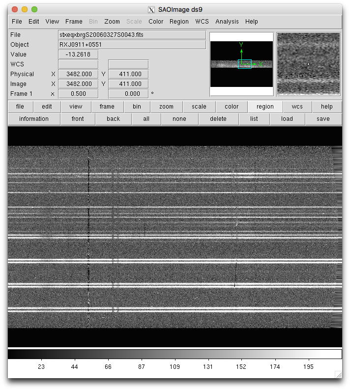

.. skysub.rst

.. _skysub:

***************
Sky Subtraction
***************
.. image:: _graphics/GMOSIFU-ProcessChart_Science.png
   :scale: 20%
   :align: right

The sky subtraction is a very straightforward step.  The ``gfskysub`` task
takes the sky fibers and use that to subtract the sky and the sky lines
from the target fibers.

|
|
|
|
|
|
|
|
|
|
|
|
|
|
|
|
|

::

    imdelete('stxeqxbrg@sci.lis', verify='no')

    for sci in iraf.type('sci.lis', Stdout=1):
        iraf.gfskysub('txeqxbrg'+sci, fl_inter='no')

And we can have a look at the results.

::

    for sci in iraf.type('sci.lis', Stdout=1):
        iraf.display('stxeqxbrg'+sci+'[sci,1]', 1)
        iraf.gfdisplay('stxeqxbrg'+sci, 1, version='1')

Notice that the sky lines are gone.  There is always that bright sky line
that never quite disappear, but the others have been removed cleanly.

The spectrum of a sky fiber is now just noise.  No sky line, and around
zero flux.

This is the spectrum of the same source as before, the one in the top-left.
Now there are no sky lines in the spectrum.

.. image:: _graphics/skysub_targetspec_after.png
   :scale: 90%
   :align: center
