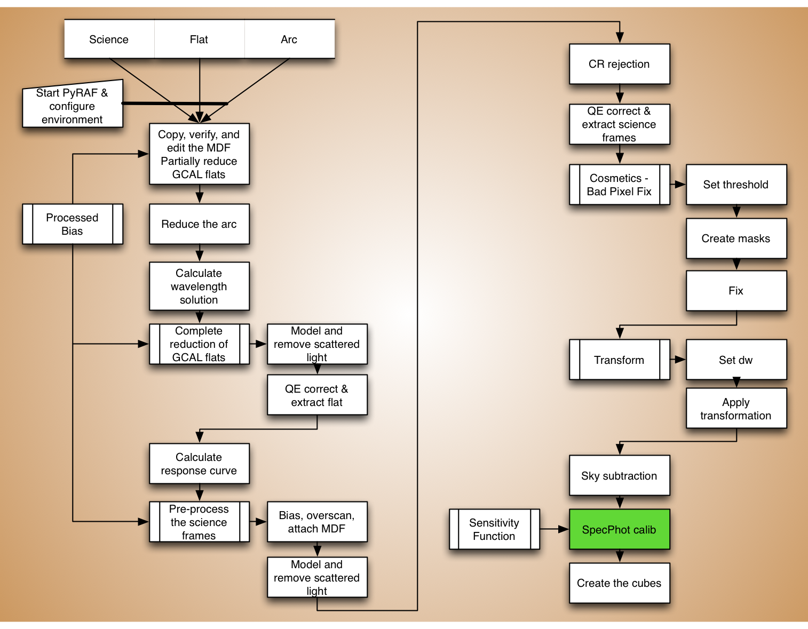
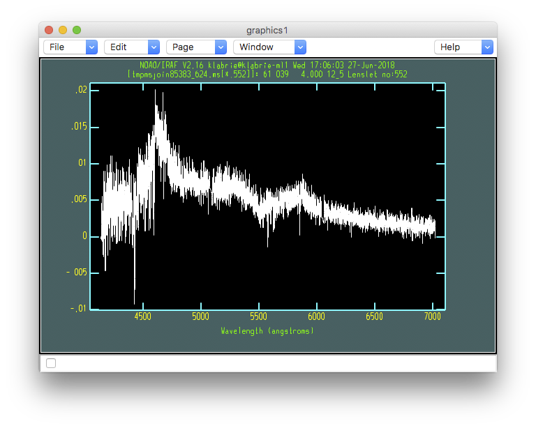

.. specphotcalib.rst

.. _spectphotcalib:

******************************
Spectrophotometric calibration
******************************
.. image:: _graphics/GMOSIFU-ProcessChart_Science.png
   :scale: 20%
   :align: right

The spectrophotometric calibration adjusts the relative strength of the
signal as a function of wavelength.  The throughput of the instrument is
not the same at all wavelength.  We have measured that relative difference
earlier when we calculated the *sensitivity function*.  Now we are going
to apply that function to correct our science spectra.

|
|
|
|
|
|
|
|
|
|
|
|
|
|

As before, we first set some important variables.

::

    sensfunc = '../calibrations/ltt4364_629_20060331_sens'
    extinction = 'onedstds$ctioextinct.dat'
    observatory = 'Gemini-South'

Then, we call ``gscalibrate``.

::

    imdelete('cstxeqxbrg@sci.lis', verify='no')

    for sci in iraf.type('sci.lis', Stdout=1):
        sci = sci.strip()
        iraf.gscalibrate('stxeqxbrg'+sci, sfunction=sensfunc, \
                    obs=observatory, extinction=extinction, \
                    fl_ext='yes', fl_vardq='yes')

We can have a look at the spectra.

::

    for sci in iraf.type('sci.lis', Stdout=1):
        iraf.gfdisplay('cstxeqxbrg'+sci, 1, version='1')

As you can see, the spectrum of the top left source has changed shape.  It
looks a bit more like a real physical source.  It is still not quite right
but that is because there is differential atmospheric refraction.  We will
correct for that in the next chapter, when we repackage the data in a
data cube.