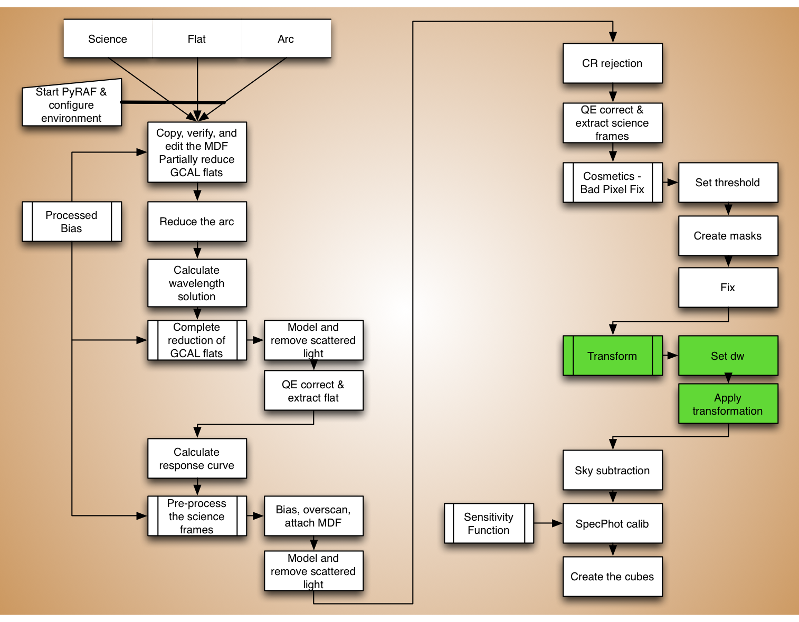
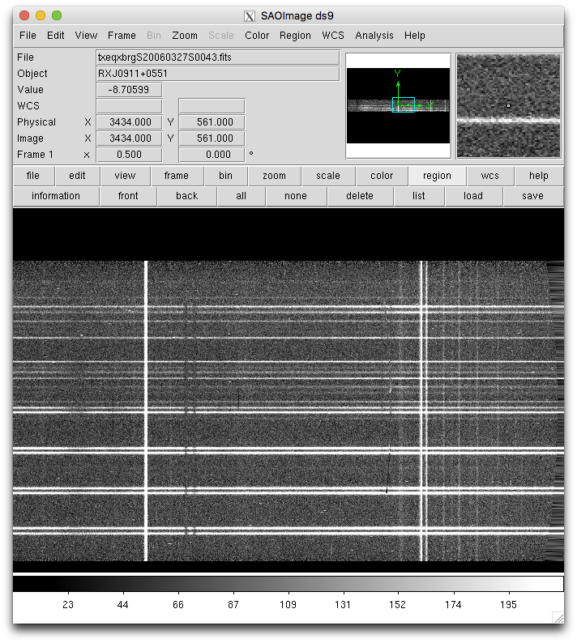

.. transform.rst

.. _transform:

*******************
Rectify the spectra
*******************
.. image:: _graphics/GMOSIFU-ProcessChart_Science.png
   :scale: 20%
   :align: right

Angstroms per pixel
===================
For most program, several exposures, hence several cubes, will need to be
combined together to reach the required signal-to-noise.  This is done
with James Turner's ``pymosaic``.  We will use it later.  But to make that
future step more robust there is something we can do here at the rectification
step.  That is to ensure that all our cubes have the wavelength scale, ie.
that the "angstroms per pixel" value is the same for all.

If the data have been taken all on the same night, it is very likely that the
automatic setting will be the same of all the cubes anyway.  However, why
not make sure of it?  It takes 1 minute and might save a lot more
time later.

So the question is what scale to use.  An easy way to figure that out is
to run ``gftransform`` as a test frame and see what the automatic algorithm
selects.  Then enforce the use of that value for all the other frames.

Let us do that now.  First we set a couple variables, then we launch
``gftransform``.

::

    test = iraf.head('sci.lis', nlines=1, Stdout=1)[0].strip()
    arc = iraf.head('arc.lis', nlines=1, Stdout=1)[0].strip()

::

    imdelete('txeqxbrg'+test, verify='no')

    gftransform('xeqxbrg'+test, wavtraname='erg'+arc, fl_vardq='no')

The screen outputs gives you the value right away.  Look for the value of
``dw``.  The software sets it to ``0.462036``.  We can use ``0.46`` for
all the cubes.

For automation purposes, know that the scale is also stored in the output's
header, in the ``CD1_1`` parameter of the World Coordinate System (WCS).

::

    hselect('txeqxbrg'+test+'[sci,1]', 'CD1_1', 'yes')

Rectify
=======

Now we just run ``gftransform`` on all the science frames enforcing the
wavelength scale to be ``0.46``.

::

    dw = 0.46

::

    imdelete('txeqxbrg@sci.lis', verify='no')

    for sci in iraf.type('sci.lis', Stdout=1):
        iraf.gftransform('xeqxbrg'+sci, wavtraname='erg'+arc, dw=dw, \
                         fl_vardq='yes')

We can have a quick look at the rectify data.  Note how the sky lines are
now straight instead of curved.

::

    for sci in iraf.type('sci.lis', Stdout=1):
        sci = sci.strip()
        iraf.display('txeqxbrg'+sci+'.fits[sci,1]', 1)
        iraf.gfdisplay('txeqxbrg'+sci, 1, version='1')

